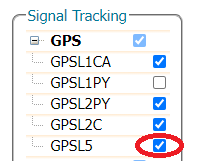

The mosaic-T is L5-capable but, because the GPS L5 service is currently pre-operational and marked as "unhealthy", it takes some extra configuration steps to enable L5. The GNSSDO firmware enables L5 reception by default. Here are the configuration steps in case you need to configure L5 manually.

## Web Interface

**Admin > Expert Control > Control Panel > Navigation > Receiver Operation > Masks** - Set "Discard unhealthy satellites" to off for both "Tracking" and "PVT"

<figure markdown>
[{ width="400" }](./assets/img/hookup_guide/L5_step1.png "Click to enlarge")
<figcaption markdown>
[L5 Configuration - Step 1 (PNG)](./assets/img/hookup_guide/L5_step1.png).
</figcaption>
</figure>

**Navigation > Advance User Settings > Tracking > Signal Tracking** : Enable GPSL5 signal tracking

<figure markdown>
[{ width="400" }](./assets/img/hookup_guide/L5_step2.png "Click to enlarge")
<figcaption markdown>
[L5 Configuration - Step 2 (PNG)](./assets/img/hookup_guide/L5_step2.png).
</figcaption>
</figure>

**Navigation > Advance User Settings > PVT > Signal Usage** - Enable GPSL5 in both “PVT” and “navigation data decoder”

<figure markdown>
[{ width="400" }](./assets/img/hookup_guide/L5_step3.png "Click to enlarge")
<figcaption markdown>
[L5 Configuration - Step 3 (PNG)](./assets/img/hookup_guide/L5_step3.png).
</figcaption>
</figure>

!!! info
    Make sure to click “OK” at the bottom of each page where you are making changes to update the current configuration, and don’t forget to save it to boot if you want the configuration to persist when you cycle power.

## Command Interface

- **`setHealthMask, Tracking, off`**
- **`setHealthMask, PVT, off`**
- **`setSignalTracking, +GPSL5`**
- **`setSignalUsage, +GPSL5, +GPSL5`**

