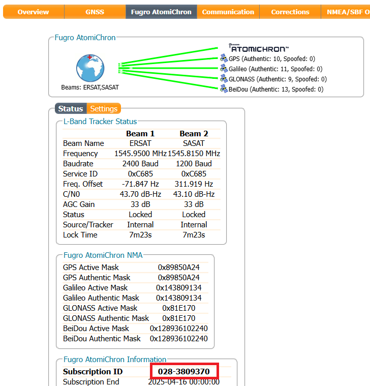
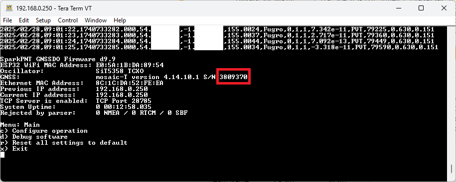

Fugro AtomiChron^®^ is a global, real-time, precise clock synchronisation and authentication service based on GNSS, for applications that require resilient, accurate and reliable time and frequency. This innovative technology eliminates time drift caused by clocks counting time at slightly different rates and gives users access to extreme frequency stability as well as extreme accurate time references, with levels that surpass high-calibre industrial standard caesium clocks and approaching hydrogen maser performance.

<figure markdown>
[{ width="600" }](./assets/img/hookup_guide/AtomiChron.png "Click to enlarge")
<figcaption markdown>Fugro AtomiChron overview.</figcaption>
</figure>

## :fontawesome-solid-screwdriver-wrench: Specifications

- Timing accuracy: <5 ns UTC (95% of the time)

- Accuracy: <1 ns to Fugro AtomiChron^®^ timescale (independent of world-wide location)

- Performance improvement: >10x better than existing high-end GNSS receivers

- Navigation Message Authentication (NMA) status: per satellite status for all 4 GNSS constellations concurrently

## Subscribing to Fugro AtomiChron^®^

AtomiChron^®^ subscriptions are managed by Fugro. We ask that you complete the [SparkPNT GNSSDO Fugro AtomiChron^®^ Service Registration Form](https://www.sparkfun.com/gnssdo_registration) and the team at Fugro will be in touch. To subscribe, Fugro will need to know the serial number of the mosaic-T inside your GNSSDO. You can find the mosaic-T serial number in several ways:

* You can view it on the Fugro AtomiChron tab of mosaic-X5's internal web page. The web page can be viewed over Ethernet or Ethernet-over-USB. Please see the [Quick Start Guide](./quick_start.md) for more details.
* The serial number is also displayed when you open the [Software Settings menu](./software_overview.md#software-settings) in a terminal emulator or serial console.

<figure markdown>
[{ width="400" }](./assets/img/hookup_guide/AtomiChron_ID_Web.png "Click to enlarge")
<figcaption markdown>Fugro AtomiChron ID on the mosaic-T web page.</figcaption>
</figure>

<figure markdown>
[{ width="400" }](./assets/img/hookup_guide/AtomiChron_ID_Menu.png "Click to enlarge")
<figcaption markdown>Fugro AtomiChron ID in the GNSSDO software settings.</figcaption>
</figure>

## Performance

With AtomiChron enabled, the GNSSDO achieves a GPS clock bias of better than 1 ns:

<figure markdown>
[{ width="600" }](./assets/img/hookup_guide/clock_bias.png "Click to enlarge")
<figcaption markdown>GPS clock bias with AtomiChron vs GPS Pulse-Per-Second offset (without AtomiChron).</figcaption>
</figure>

With AtomiChron enabled, the Pulse-Per-Second Allan Deviation approaches 1E-14 at 10000 seconds:

<figure markdown>
[{ width="400" }](./assets/img/hookup_guide/Allan_Deviation.jpg "Click to enlarge")
<figcaption markdown>Pulse-Per-Second Allan Deviation with and without AtomiChron.</figcaption>
</figure>

## Firmware configuration

Without an AtomiChron subscription, the firmware will use the composite GNSS **RxClkBias** from **PVTGeodetic** to discipline the TCXO frequency.

<figure markdown>
[{ width="400" }](./assets/img/hookup_guide/AtomiChron-Expired.png "Click to enlarge")
<figcaption markdown>By default, the Fugro AtomiChron subscription shows as "expired".</figcaption>
</figure>

With AtomiChron, the firmware will use the Fugro composite bias reported in **FugroTimeOffset** to discipline the TCXO frequency. You also have the option to prefer the individual GPS or Galileo clock bias over the Fugro composite bias. Please refer to the [ESP32 firmware settings](./software_overview.md#configure-operation) for more details.

<figure markdown>
[{ width="400" }](./assets/img/hookup_guide/AtomiChron-Active.png "Click to enlarge")
<figcaption markdown>The mosaic-T with an active Fugro AtomiChron subscription.</figcaption>
</figure>

