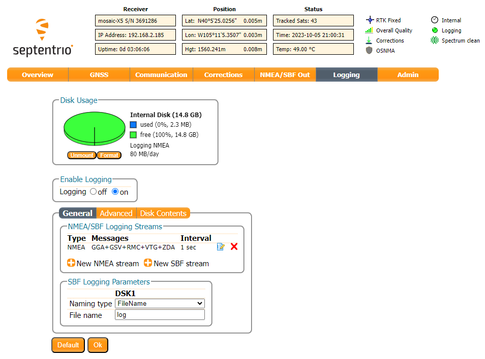

!!! warning
	When assembling the GNSSDO, users should attach any power connections last. While there shouldn't be any issues with hot-swapping peripherals, it is common practice to power electronics as the last step of the assembly process *(and the power should be disconnected before removing components)*.

??? info "What is in the Box?"
	The GNSSDO comes packaged as a complete kit, with all the accessories you'd need to set it up.

	<figure markdown>
	[{ width="300" }](https://cdn.sparkfun.com/assets/parts/2/7/2/0/7/26289-GNSS-Disciplined-Oscillator-Kit-Feature.jpg "Click to enlarge")
	<figcaption markdown>
	Everything that is included in the GNSSDO kit.
	</figcaption>
	</figure>

	Inside the box, users will find the [GNSS antenna](https://www.sparkfun.com/gnss-multi-band-l1-l2-l5-surveying-antenna-tnc-spk6618h.html), GNSSDO in its aluminum enclosure, a [USB-C cable](https://www.sparkfun.com/usb-c-to-usb-c-silicone-power-charging-cable-3m.html), [CAT-6 Ethernet cable](https://www.sparkfun.com/cat-6-cable-3ft.html), and another box containing additional accessories. Inside the accessory box, users will find the [SMA to TNC cable](https://www.sparkfun.com/reinforced-interface-cable-sma-male-to-tnc-male-10m.html), [SMA to BNC cable](https://www.sparkfun.com/sma-to-bnc-male-cable-rg316-1m.html), [USB PD wall adapter](https://www.sparkfun.com/usb-a-and-c-power-delivery-pd-wall-adapter-65w.html), [silicone bumpers](https://www.sparkfun.com/silicone-bumpers-5x11mm-4-pack.html), and [32GB SD card](https://www.sparkfun.com/microsd-card-32gb-class-10.html).

## USB-C Ports
The USB ports are utilized to configure the mosaic-T module and ESP32 firmware settings. Additionally, the USB ports can also be used as a power source for the GNSSDO.

The USB port to the mosaic-T can be used to configure the module through an IP port, for serial communication to stream the GNSS data, and access the SD card as a mass storage device. To connect to the mosaic-T, users only need to plug a USB-C cable into the `CONFIG MOSAIC` USB port and their computer.

<figure markdown>
[{ width="400" }](./assets/img/hookup_guide/assembly-usb-mosaic.jpg "Click to enlarge")
<figcaption markdown>The GNSSDO with USB-C cable being attached.</figcaption>
</figure>

With the default firmware, the USB port for the ESP32 is used for serial communication to tune the parameters for the TCXO oscillator and the Pulse-Per-Second output. To configure the settings, users only need to plug a USB-C cable into the `CONFIG ESP32` USB port and their computer, and then open a terminal emulator at 115200 baud.

<figure markdown>
[{ width="400" }](./assets/img/hookup_guide/assembly-usb-esp32.jpg "Click to enlarge")
<figcaption markdown>The GNSSDO with USB-C cable being attached.</figcaption>
</figure>

!!! tip "Software Requirements"
	Depending on their computer's operating system, users may need to install USB drivers to interface with the mosaic-T and/or the ESP32. Users may also need to install a terminal emulator for serial communication with the mosaic-T and the ESP32.

## Antennas

In order to receive [GNSS](https://en.wikipedia.org/wiki/Satellite_navigation "Global Navigation Satellite System") signals, users will need a compatible antenna. With the parts included in this kit, connect the L1/L2/L5 (tri-band) GNSS antenna to the GNSSDO using the TNC-to-SMA cable.

<figure markdown>
[{ width="400" }](./assets/img/hookup_guide/assembly-gnss-tnc.jpg "Click to enlarge")
<figcaption markdown>Attaching a tri-band GNSS antenna to the TNC-SMA cable.</figcaption>
</figure>

<figure markdown>
[{ width="400" }](./assets/img/hookup_guide/assembly-gnss_antenna.jpg "Click to enlarge")
<figcaption markdown>Attaching a TNC-SMA cable to the SMA connector on the GNSSDO.</figcaption>
</figure>

??? tip "Mounting Location"
	Users should mount their GNSS antenna outside, where it will have a clear, unobstructed view of the sky. Avoid areas with nearby buildings, EMF structures (i.e. radio towers or power lines), and vegetation (i.e. trees). These objects can increase errors due to signal muti-path, interference, and elevated noise plane.

	<figure markdown>
	[{ width="400" }](./assets/img/hookup_guide/assembly-gnss-mount_location.jpg "Click to enlarge")
	<figcaption markdown>The tri-band GPS antenna, mounted outside with an unobstructed view of the sky.</figcaption>
	</figure>

??? tip "Connector Polarity"
	When selecting antennas and/or cables for the GNSSDO, double-check the polarity of the connection.

## Ethernet Jack
There is a single ethernet jack on the GNSSDO, which can be used to provide network access to the mosaic-T module. It supports [power over ethernet (PoE)](https://en.wikipedia.org/wiki/Power_over_Ethernet "PoE") to power the device.

The jack to the mosaic-T allows users to provide internet access and power; it supports [PoE](https://en.wikipedia.org/wiki/Power_over_Ethernet "Power over Ethernet"). To provide network access, users should connect the GNSSDO from the `ETHERNET (PoE)` jack to their local network with the (CAT-6) ethernet cable provided in the kit.

- To power the device, a PoE network switch or PoE injector should be installed in between the network connection to the GNSSDO.

<figure markdown>
[{ width="400" }](./assets/img/hookup_guide/assembly-ethernet-mosaic.jpg "Click to enlarge")
<figcaption markdown>The GNSSDO with ethernet cable being attached to the `ETHERNET (PoE)` jack.</figcaption>
</figure>

??? tip "Configuration: mosaic-T Settings"
	Users can configure the mosaic-T module through the network connection.

	??? info "No IP address?"
		Check the Ethernet interface is enabled. It may be disabled. Connect via the CONFIG MOSAIC USB-C port and open 192.168.3.1 on a web browser. Check the **Communication \ Ethernet** sub-page.

		<figure markdown>
		[{ width="150" }](./assets/img/hookup_guide/Ethernet-disabled.png "Click to enlarge")
		<figcaption markdown>
		[mosaic-T web page (PNG)](./assets/img/hookup_guide/Ethernet-disabled.png) with Ethernet disabled.
		</figcaption>
		</figure>

		<figure markdown>
		[{ width="150" }](./assets/img/hookup_guide/Ethernet-enabled.png "Click to enlarge")
		<figcaption markdown>
		[mosaic-T web page (PNG)](./assets/img/hookup_guide/Ethernet-enabled.png) with Ethernet enabled.
		</figcaption>
		</figure>

		By default, the mosaic-T Ethernet port is configured for Dynamic Host Configuration Protocol (DHCP). It expects the router / Ethernet switch to provide it with an IP address. If the IP address is all zeros (0.0.0.0), check that your router has DHCP enabled. Most do.

		If you need a static IP address, you can configure this through the mosaic-T's **Communication \ Ethernet** sub-page.

		Subnet 3 is reserved for the mosaic-T's USB-C connection (Ethernet-over-USB). If your router / switch is allocating addresses using subnet 3 (192.168.3.***), please change its settings so it uses a different subnet.

## SD Card Slot
An &micro;SD card slot is available for users to log and store data, locally on the board. Users will need to insert a compatible SD card and configure the mosaic-T module for data logging.

<figure markdown>
[{ width="400" }](./assets/img/hookup_guide/assembly-sd_card.jpg "Click to enlarge")
<figcaption markdown>Inserting an SD card into the GNSSDO.</figcaption>
</figure>

!!! info "SD Card Compatibility"
	The mosaic-T supports &micro;SD cards with a **FAT32** file system *(i.e. only cards **up to 32GB** in size)*.

??? warning "Initial Configuration"
	Before logging can take place, it is necessary to define a "logging stream" using the **Logging** page or **RxTools**. Streams can contain NMEA or SBF (Septentrio Binary Format) data; SBF can contain RTCM and/or RINEX.

	<figure markdown>
	[{ width="400" }](./assets/img/hookup_guide/Logging.png "Click to enlarge")
	<figcaption markdown>microSD logging stream configuration.</figcaption>
	</figure>

	!!! tip "Instructional Video"
		:material-youtube: [How to log data to the SD card of the Septentrio mosaic receiver module](https://youtu.be/Y9tvOebnoxk)

??? tip "Button Operation"
	There are multiple ways to configure and enable data logging to an SD card. However, the simplest method is with the ++"LOG"++ button. Once the stream is defined,

	- Pressing the ++"LOG"++ button *(< 5s)* toggles data logging to the SD card on and off.
	- Holding the ++"LOG"++ button for more than 5 seconds *(> 5s)* and then releasing it, will force the board to:
		- Unmount the SD card if it was mounted
		- Mount the SD card if it was unmounted

	For more information, please reference the [SD Card Slot](../hardware_overview/#sd-card-slot) section.

## IO Terminals
Users can easily attach accessories to the GNSSDO by wiring them into the terminal blocks on the back of the enclosure.

<figure markdown>
[{ width="400" }](./assets/img/hookup_guide/assembly-terminal_block2.jpg "Click to enlarge")
<figcaption markdown>Connecting a wire to the terminal block.</figcaption>
</figure>

??? tip "Multiple Connections"
	For multiple connections or wiring harnesses, users can disconnect the terminal block from its socket on the GNSSDO.

	<figure markdown>
	[{ width="400" }](https://cdn.sparkfun.com/assets/parts/2/2/5/2/5/22461-_PRT_10-Way_Terminal___Socket-_01.jpg "Click to enlarge")
	<figcaption markdown>Components of the terminal block.</figcaption>
	</figure>

	Users can wiggle or use a soft/rigid object to carefully pry the terminal block off from its connector. In the picture below, a plastic name tag (~1.5mm thick) is used to carefully pry the terminal block up. We have also found the edge of a [PCB ruler](https://www.sparkfun.com/products/15295) works great too.

	<figure markdown>
	[{ width="400" }](./assets/img/hookup_guide/disassembly-terminal_block.jpg "Click to enlarge")
	<figcaption markdown>Using a soft/rigid object to carefully pry the terminal block free from its socket.</figcaption>
	</figure>

	Once wired up, users can simply push the terminal block back into its socket.

	

	

	<figure markdown>
	[{ width="400" }](./assets/img/hookup_guide/assembly-terminal_block.jpg "Click to enlarge")
	<figcaption markdown>Connecting a wire to the terminal block.</figcaption>
	</figure>

	

	

	<figure markdown>
	[{ width="400" }](./assets/img/hookup_guide/assembly-terminal_block-attach.jpg "Click to enlarge")
	<figcaption markdown>Attaching the terminal block to its socket on the GNSSDO.</figcaption>
	</figure>

	

	

	!!! warning
		To avoid shorts or damaging the GNSSDO, verify the wiring with the labels on the back of the enclosure.

