!!! warning "Read Before Handling PCB!"
	!!! danger "ESD Sensitivity"
		The mosaic-T module is sensitive to [ESD](https://en.wikipedia.org/wiki/Electrostatic_discharge "Electrostatic Discharge"). Use a proper grounding system to make sure that the working surface and the components are at the same electric potential.

	??? info "ESD Precaution"
		As recommended by the manufacturer, we highly encourage users to take the necessary precautions to avoid damaging their module.

		- The GPSDO features ESD protection on the USB-C connectors, ethernet jack, I/O terminals and antenna connections.

		

		

		

		<article class="video-500px">
		<iframe src="https://www.youtube.com/embed/hrL5J6Q5gX8?si=jOPBat8rzMnL7Uz4&amp;start=26;&amp;end=35;" title="Septentrio: Getting Started Video (playback starts at ESD warning)" frameborder="0" allow="accelerometer; autoplay; clipboard-write; encrypted-media; gyroscope; picture-in-picture" allowfullscreen></iframe>
		</article>
		

		

		-   <a href="https://www.sparkfun.com/products/25572">
			<figure markdown>
			
			</figure>		

			---

			**iFixit Anti-Static Wrist Strap** 
			TOL-25572</a>

		

!!! code "ESP32 Firmware"
	We have intentionally kept the ESP32 firmware as simple as possible - it only disciplines the TCXO oscillator and controls the OLED display. The SparkFun RTK Firmware or SparkFun RTK Everywhere firmware will not run on this product. The intention is that you can easily develop your own firmware for the GPSDO if the SparkFun firmware does not meet your needs.

	The **[/Firmware/Binaries](https://github.com/sparkfun/SparkFun_GPSDO/tree/main/Firmware/Binaries)** folder contains the firmware binaries.
	
	You can update or reload the firmware using the [SparkFun RTK Firmware Uploader](https://github.com/sparkfun/SparkFun_RTK_Firmware_Uploader).

	You can of course modify the hardware too, should you want to. The design is completely open-source.

# Hardware Overview

In this section, we walk you through the hardware design, interfaces, I/O connections, power options and more.

## Schematic
Users can download the [full schematic for the GPSDO](./assets/board_files/schematic.pdf) in `*.pdf` format.

## Dimensions

=== ":material-package-variant-closed: Metal Enclosure"
	Details about the aluminum enclosure can be found on the [Metal Enclosure - Custom Aluminum Extrusion (6in. x 4in. PCB)](https://www.sparkfun.com/products/22640) product page.

	<figure markdown>
	[{ width="700" }](./assets/board_files/dimensions-enclosure.pdf "Click to enlarge")
	<figcaption markdown>
	[Dimensions (PDF)](./assets/board_files/dimensions-enclosure.pdf) of the GPSDO aluminum enclosure and the front/rear panels, in millimeters.
	</figcaption>
	</figure>

=== ":fontawesome-solid-microchip: Printed Circuit Board"
	The circuit board dimensions are illustrated in the drawing below; the listed measurements are in inches.

	<figure markdown>
	[{ width="400" }](./assets/board_files/dimensions.png "Click to enlarge")
	<figcaption markdown>
	[Dimensions (PNG)](./assets/board_files/dimensions.png) of the GPSDO PCB, in inches.
	</figcaption>
	</figure>

	??? tip "Need more measurements?"
		For more information about the board's dimensions, users can download the [**KiCad files**](./assets/board_files/kicad_files.zip) for the board. These files can be opened in KiCad 8 and additional measurements can be made with the dimensions tool.

=== ":material-video-input-antenna: Antenna"
	The dimensions and technical specifications of the GNSS antenna can be found on the [GNSS Multi-Band L1/L2/L5 Surveying Antenna - TNC (SPK6618H)](https://www.sparkfun.com/products/21801) product page.

	<figure markdown>
	[{ width="400" }](./assets/board_files/dimensions-antenna.png "Click to enlarge")
	<figcaption markdown>
	Dimensions of the included GNSS antenna, in mm. 
	Source: [SPK6618H Datasheet (PDF)](https://cdn.sparkfun.com/assets/f/f/5/1/7/SparkFun_SPK6618H_Datasheet.pdf)
	</figcaption>
	</figure>

## Power Options
The mosaic-T and the ESP32 both required 3.3V power. To simplify the power circuitry, the four power sources are combined into a common 5V rail which then feeds individual 3.3V regulators for the mosaic-T and the ESP32.

<figure markdown>
[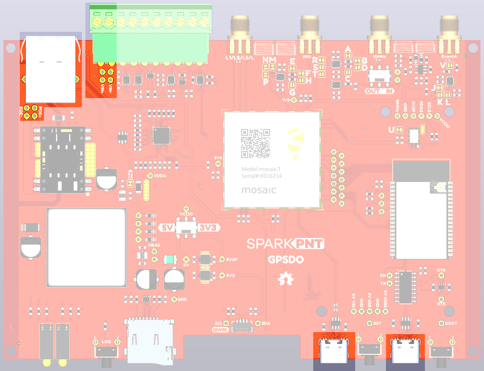{ width="400" }](./assets/img/hookup_guide/Power.png "Click to enlarge")
<figcaption markdown>Power connections on the GPSDO PCB.</figcaption>
</figure>

The GPSDO can be powered individually or in combination, with any of the following:

* **`USB Ports`** - **5V**; delivered via the `MOSAIC CONFIG` and/or `ESP32 CONFIG` USB-C connectors.
* **`Power-over-Ethernet`** - **Range: 36 to 57V**; delivered via the `MOSAIC ETHERNET` RJ45 MagJack connector.
* **`External DC Power`** - **Range: 9 to 36V**; delivered via the `VIN+` and `VIN-` screw cage terminals.

??? tip "Measure Current Draw"
	If you want to measure the board's current draw, you can open the `MEAS` jumper and measure the current via a pair of breakout pads *(see the **[Jumpers](#jumpers)** section)*.

??? info "Protection Components"
	Diodes are used to combine and protect the power sources from each other. Also, a 2A resettable fuse (green) provides additional protection.

!!! info
	For more details, users can reference the [schematic](./assets/board_files/schematic.pdf) and the datasheets of the individual components on the board.

=== ":material-usb-port: USB-C Connectors"
	The mosaic-T and ESP32 both have USB-C connections. These USB ports can be used to power the GPSDO during the initial configuration when the mosaic-T or ESP32 are connected to a computer.

	

	

	<figure markdown>
	[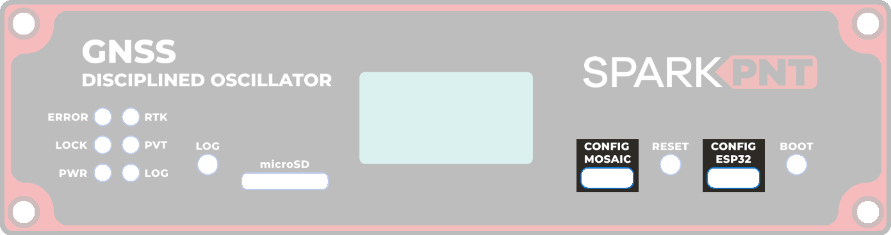{ width="750" }](./assets/img/hookup_guide/USB.png "Click to enlarge")
	<figcaption markdown>USB-C connectors on the GPSDO.</figcaption>
	</figure>

	

	

	<figure markdown>
	[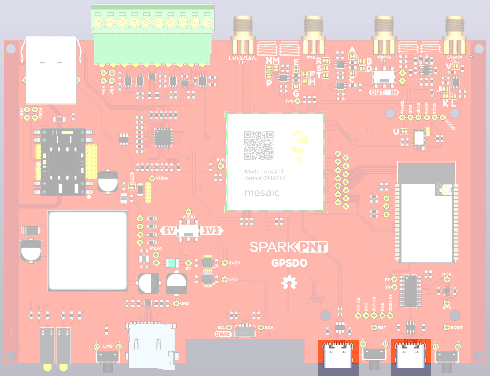{ width="400" }](./assets/img/hookup_guide/USB-PCB.png "Click to enlarge")
	<figcaption markdown>The USB-C device connections on the GPSDO PCB.</figcaption>
	</figure>

	

	

	!!! info "CH340 Driver"
		The CH340 allows the ESP32-WROVER to communicate with a computer/host device through the USB-C connection. This allows the ESP32 to show up as a device on the serial (or COM) port of the computer. Users will need to install the latest drivers for the computer to recognize the CH340 *(see **[USB Driver](./software_overview.md#usb-driver_1)** section)*.

=== ":material-ethernet: Power-over-Ethernet (PoE)"
	The mosaic-T Ethernet port supports Power-over-Ethernet ([PoE](https://en.wikipedia.org/wiki/Power_over_Ethernet "Power Over Ethernet")), allowing the GPSDO to be powered by the network. This is very useful when the GPSDO is mounted remotely - perhaps in a weatherproof box up on the roof. Data and power can be delivered through a single cable, avoiding the need for a separate power connection.

	

	

	<figure markdown>
	[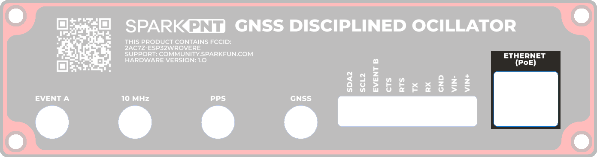{ width="750" }](./assets/img/hookup_guide/POE.png "Click to enlarge")
	<figcaption markdown>The Power-over-Ethernet (PoE) jack on the GPSDO.</figcaption>
	</figure>

	

	

	<figure markdown>
	[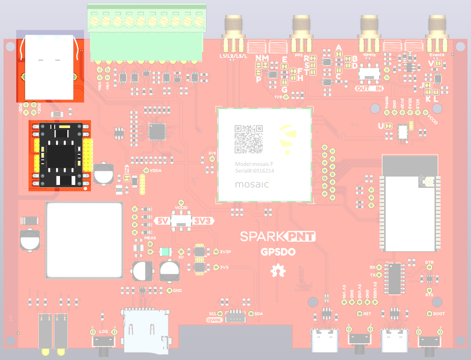{ width="400" }](./assets/img/hookup_guide/POE-PCB.png "Click to enlarge")
	<figcaption markdown>The PoE power input circuit on the GPSDO PCB.</figcaption>
	</figure>

	

	

=== ":material-car-battery: External DC Power (VIN)"
	The GPSDO includes a fully-isolated DC-DC converter, for applications where you may want to power the unit from a vehicle. The DC-DC converter accepts DC voltages between **9V and 36V**, regulating this down to 5V. The converter is fully isolated to 1.5kV and operates with ~90% efficiency.

	

	

	<figure markdown>
	[{ width="750" }](./assets/img/hookup_guide/VIN.png "Click to enlarge")
	<figcaption markdown>The `VIN+` and `VIN-` screw terminal pins for the external DC power input.</figcaption>
	</figure>

	

	

	<figure markdown>
	[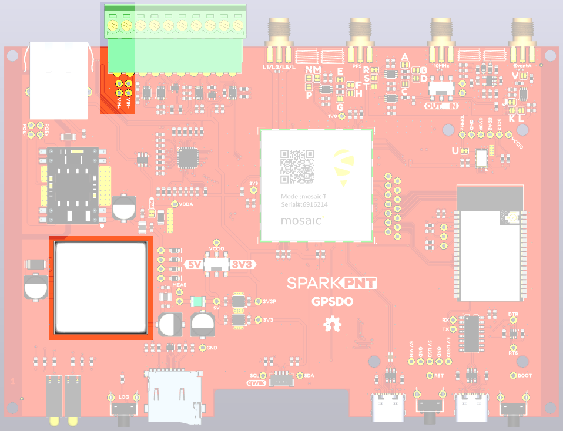{ width="400" }](./assets/img/hookup_guide/VIN-PCB.png "Click to enlarge")
	<figcaption markdown>The DC-DC power converter and external power inputs on the GPSDO PCB.</figcaption>
	</figure>

	

	

	??? tip "Vehicle Power"
		For **12V** or **24V** vehicle power:

		* Connect 12V or 24V to the `VIN+` screw cage terminal
		* Connect 0V (chassis) to the `VIN-` screw cage terminal

		!!! warning "Power Source"
			Additionally, make sure that the power source from the vehicle is not directly tied to the vehicle's battery, `Always On`, or accessory circuits. Otherwise, users will risk draining the battery while the engine is off.

			We recommend locating the *ignition on* or *switched power* circuit, which is only powered when the key is in the `On` position *and the engine is running*.

			!!! note
				The `On` position, is where a key normally rests after the engine is started. However, users can still move the key from the `Off` position and into the `On` position without starting the engine. In this case, the alternator is not running and keeping the battery charged.

				Modern *eco-efficient* vehicles may automatically shut down the engine if the vehicle is idling too long. Therefore, cutting off the vehicle's alternator that keeps the battery charged. Luckily, most vehicles with this *automatic start/stop* technology will monitor the battery's voltage and restart the engine when required. With this in mind, users may want to initially monitor their battery voltage, in case their vehicle isn't *"so smart"* :sweat_smile:.

	??? warning "Ground Loop"
		If desired, users can link `VIN-` to the adjacent `GND` screw cage terminal. However, this will bypass the voltage isolation and could introduce an unwanted ground loop, particularly if the GNSS antenna ground (shield, 0V) is also connected to the chassis.

## :septentrio-logo:&nbsp;mosaic-T
The heart of our product is of course the mosaic-T GNSS module from Septentrio. It is a _very_ sophisticated chip with multiple interfaces: UARTS, USB and Ethernet. The `COM3` UART pins, plus `GPIO1` and `GPIO2`, are available as 0.1" test points should you need access to them.

<figure markdown>
[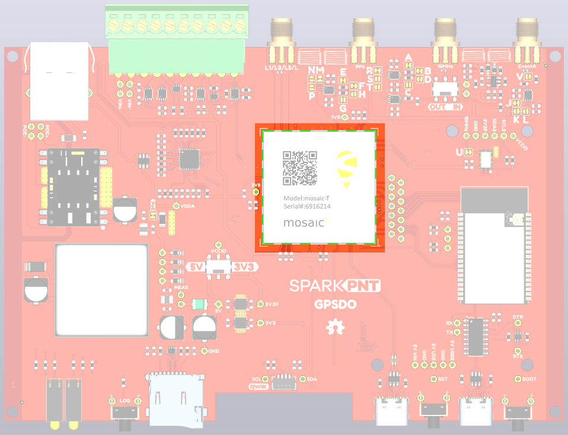{ width="400" }](./assets/img/hookup_guide/T.png "Click to enlarge")
<figcaption markdown>The Septentrio mosaic-T GNSS module.</figcaption>
</figure>

## :espressif-logo:&nbsp;ESP32-WROVER
The ESP32 processor is there to control (discipline) the 10 MHz TCXO oscillator and the OLED display. We have deliberately kept the ESP32 firmware as simple as possible. The intention is that you can write your own firmware using the Espressif IDF or Arduino IDE if you need to. The ESP32-WROVER-IE antenna is connected to the **ESP32** RP SMA connector on the rear panel but it is unused by the SparkFun firmware.

<figure markdown>
[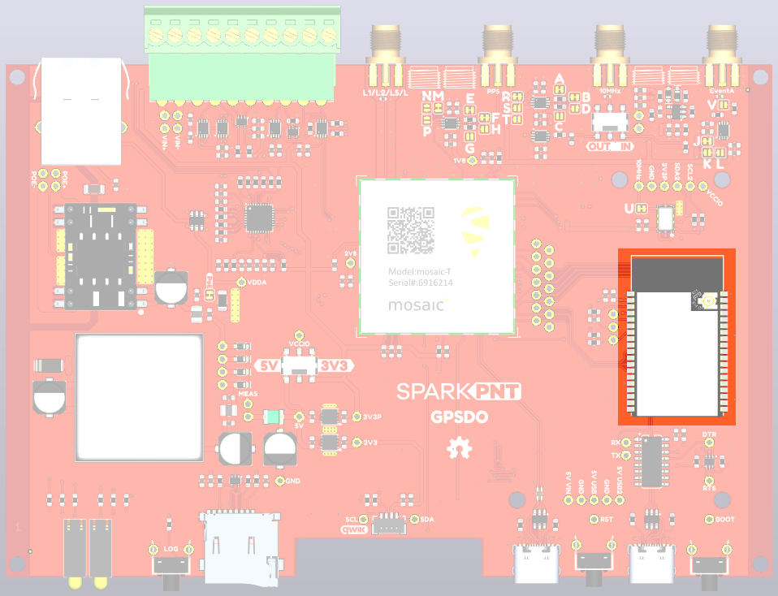{ width="400" }](./assets/img/hookup_guide/ESP32.png "Click to enlarge")
<figcaption markdown>The Espressif ESP32-WROVER processor.</figcaption>
</figure>

Think of the ESP32 as a co-processor, or riding shotgun... The mosaic-T `COM1` and `COM4` UARTs are linked to the ESP32, allowing the two to communicate directly without needing an Ethernet link. In our firmware, the PVTGeodetic and ReceiverTime messages are output on COM1. The ESP32 displays some of their content on the I2C OLED display, and then uses the content to discipline the TCXO oscillator. See [Oscillator](./oscillator.md) for more details.

??? code "ESP32 Firmware"
	We have intentionally kept the ESP32 firmware as simple as possible. The intention is that users can easily develop their, own firmware for the GPSDO using the Espressif ESP IDF or the Arduino IDE if the SparkFun firmware does not meet their needs.

	The **[/Firmware/Binaries](https://github.com/sparkfun/SparkFun_GPSDO/tree/main/Firmware/Binaries)** folder contains the firmware binaries.
	
	You can update or reload the firmware using the [SparkFun RTK Firmware Uploader](https://github.com/sparkfun/SparkFun_RTK_Firmware_Uploader).

## Ethernet PHY Interface
The mosaic-T has a KSZ8041NLI Ethernet PHY interface, connected using a Reduced Media-Independent Interface (RMII).

<figure markdown>
[{ width="750" }](./assets/img/hookup_guide/POE.png "Click to enlarge")
<figcaption markdown>Ethernet (PoE) conection.</figcaption>
</figure>

<figure markdown>
[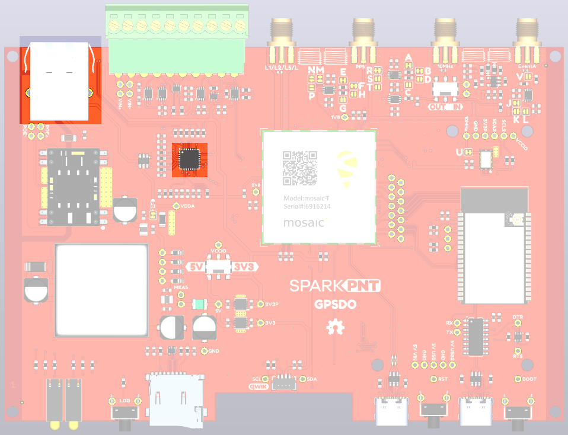{ width="400" }](./assets/img/hookup_guide/PHY-PCB.png "Click to enlarge")
<figcaption markdown>The Ethernet PHY on the GPSDO PCB.</figcaption>
</figure>

??? info "No IP address?"
	Check the Ethernet interface is enabled. It may be disabled. Connect via the CONFIG MOSAIC USB-C port and open 192.168.3.1 on a web browser. Check the **Communication \ Ethernet** sub-page.

	<figure markdown>
	[{ width="150" }](./assets/img/hookup_guide/Ethernet-disabled.png "Click to enlarge")
	<figcaption markdown>
	[mosaic-T web page (PNG)](./assets/img/hookup_guide/Ethernet-disabled.png) with Ethernet disabled.
	</figcaption>
	</figure>

	<figure markdown>
	[{ width="150" }](./assets/img/hookup_guide/Ethernet-enabled.png "Click to enlarge")
	<figcaption markdown>
	[mosaic-T web page (PNG)](./assets/img/hookup_guide/Ethernet-enabled.png) with Ethernet enabled.
	</figcaption>
	</figure>

	By default, the mosaic-T Ethernet port is configured for Dynamic Host Configuration Protocol (DHCP). It expects the router / Ethernet switch to provide it with an IP address. If the IP address is all zeros (0.0.0.0), check that your router has DHCP enabled. Most do.

	If you need a static IP address, you can configure this through the mosaic-T's **Communication \ Ethernet** sub-page.

	Subnet 3 is reserved for the mosaic-T's USB-C connection (Ethernet-over-USB). If your router / switch is allocating addresses using subnet 3 (192.168.3.***), please change its settings so it uses a different subnet.

## USB-C Connectors
The mosaic-T and ESP32 both have USB-C connections. The MOSAIC USB port is high-speed and connected to the T through a balancing transformer. The ESP32 USB port is connected through a CH340 USB-UART IC.

<figure markdown>
[{ width="750" }](./assets/img/hookup_guide/USB.png "Click to enlarge")
<figcaption markdown>USB-C connections: mosaic-T (left) and ESP32 (right).</figcaption>
</figure>

<figure markdown>
[{ width="400" }](./assets/img/hookup_guide/USB-PCB.png "Click to enlarge")
<figcaption markdown>The USB-C data connections on the GPSDO PCB.</figcaption>
</figure>

!!! info
	The GPSDO can draw power from either or both USB ports, in addition to Power-over-Ethernet and the DC-DC external input described above.

!!! info "CH340 Driver"
	The CH340 allows the ESP32-WROVER to communicate with a computer/host device through the USB-C connection. This allows the ESP32 to show up as a device on the serial (or COM) port of the computer. Users will need to install the latest drivers for the computer to recognize the CH340 *(see **[USB Driver](./software_overview.md#usb-driver_1)** section)*.

## &micro;SD Socket
The &micro;SD socket is connected directly to the mosaic-T via a one-bit SDIO interface for fast data logging. The mosaic-T supports &micro;SD cards with a **FAT32** file system *(i.e. only cards **up to 32GB** in size)*.

<figure markdown>
[{ width="750" }](./assets/img/hookup_guide/Log.png "Click to enlarge")
<figcaption markdown>&micro;SD slot and ++"LOG"++ button.</figcaption>
</figure>

<figure markdown>
[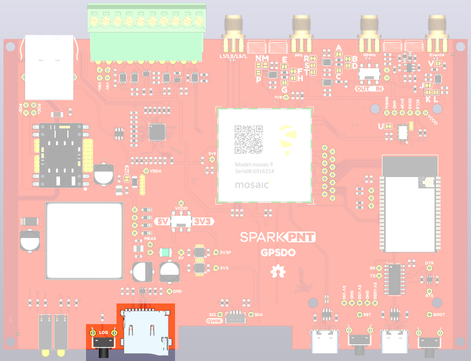{ width="400" }](./assets/img/hookup_guide/Log-PCB.png "Click to enlarge")
<figcaption markdown>&micro;SD socket and ++"Log"++ button on the GPSDO PCB.</figcaption>
</figure>

??? info "Operation Instructions"

	!!! success "Initial Configuration"
		Before logging can take place, it is necessary to define a "logging stream" using the **Logging** page or **RxTools**. Streams can contain NMEA or SBF (Septentrio Binary Format) data; SBF can contain RTCM and/or RINEX.

		<figure markdown>
		[{ width="400" }](./assets/img/hookup_guide/Logging.png "Click to enlarge")
		<figcaption markdown>&micro;SD logging stream configuration.</figcaption>
		</figure>
		
		!!! tip "Instructional Video"
			:material-youtube: [How to log data to the SD card of the Septentrio mosaic receiver module](https://youtu.be/Y9tvOebnoxk)

	Once the stream is defined, users can control the data logging operation through the ++"LOG"++ button.

	* A short press of the ++"LOG"++ button *(< 5s)* toggles data logging to the SD card on and off.
		* The red `LOG` LED will flash while logging is taking place.
	* A long press, holding the ++"LOG"++ button for more than 5 seconds *(> 5s)* and then releasing it, will force the board to:
		* Unmount the SD card if it was mounted
		* Mount the SD card if it was unmounted

## SMA Connectors
The GPSDO has robust SMA connectors for the mosaic-T GNSS antenna, Pulse-Per-Second output, 10 MHz input / output, and the Event A input.

<figure markdown>
[{ width="750" }](./assets/img/hookup_guide/Ant-GNSS.png "Click to enlarge")
<figcaption markdown>The SMA connector for the GNSS antenna.</figcaption>
</figure>

<figure markdown>
[{ width="400" }](./assets/img/hookup_guide/RF-GNSS.png "Click to enlarge")
<figcaption markdown>The connection for the GNSS antenna to the mosaic-T.</figcaption>
</figure>

The mosaic-T GNSS SMA connector is standard polarity and provides 3.3V power for an active antenna.

<figure markdown>
[{ width="750" }](./assets/img/hookup_guide/PPS.png "Click to enlarge")
<figcaption markdown>The SMA connector for the Pulse-Per-Second output.</figcaption>
</figure>

<figure markdown>
[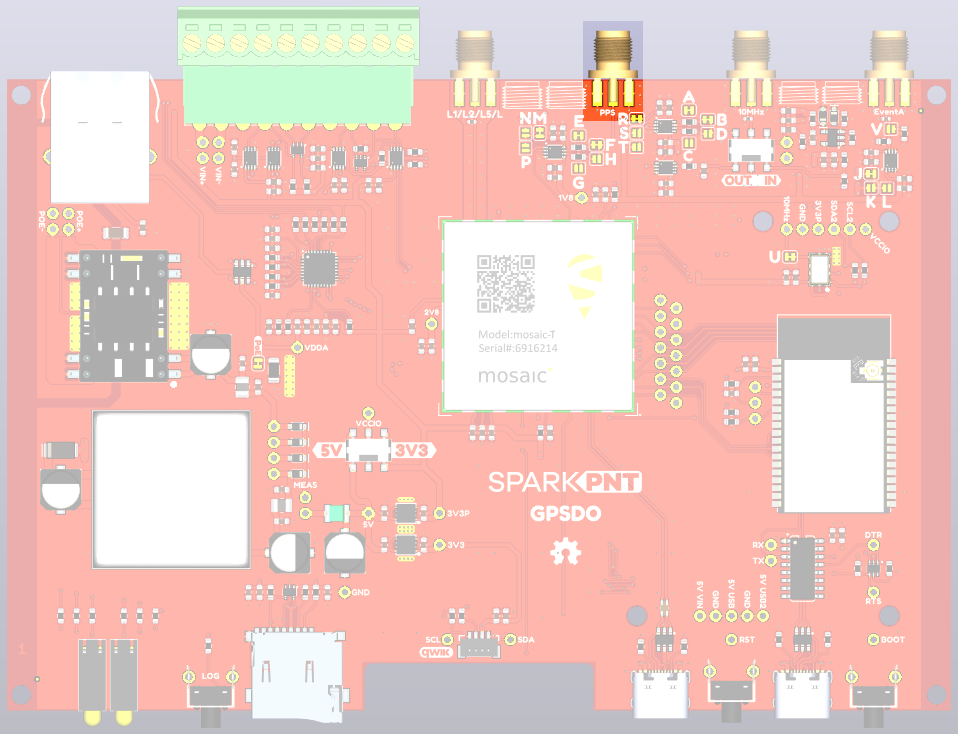{ width="400" }](./assets/img/hookup_guide/PPS-PCB.png "Click to enlarge")
<figcaption markdown>The connection for the Pulse-Per-Second output.</figcaption>
</figure>

The Pulse-Per-Second SMA connector is standard polarity. The voltage is selectable via the VCCIO switch: 3.3V or 5V. 2.8V and 1.8V are also available via the jumper links *(see the **[Jumpers](#jumpers)** section)*. The output is DC-coupled. The output can be configured for 50 Ohm output via the jumper links *(see the **[Jumpers](#jumpers)** section)*.

<figure markdown>
[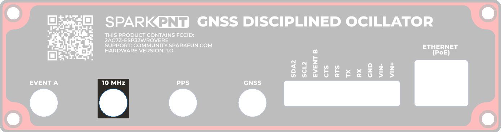{ width="750" }](./assets/img/hookup_guide/10MHz.png "Click to enlarge")
<figcaption markdown>The SMA connector for the 10 MHz output / input.</figcaption>
</figure>

<figure markdown>
[{ width="400" }](./assets/img/hookup_guide/10MHz-Switch-PCB.png "Click to enlarge")
<figcaption markdown>The connection for the 10 MHz output / input.</figcaption>
</figure>

The 10 MHz SMA connector is standard polarity. The voltage is adjustable via the VCCIO switch: 3.3V or 5V. 2.8V and 1.8V are also available via the jumper links *(see the **[Jumpers](#jumpers)** section)*. The output can also be configured for 50 Ohm via the jumper links *(see the **[Jumpers](#jumpers)** section)*. Output / Input is selected via the small slide switch adjacent to the connector. When configured for input: the input impedance is 50Ω; the detection level is -14dBm; the max supported input level is +12dBm.

<figure markdown>
[{ width="750" }](./assets/img/hookup_guide/EventA.png "Click to enlarge")
<figcaption markdown>The SMA connector for the EventA input.</figcaption>
</figure>

<figure markdown>
[{ width="400" }](./assets/img/hookup_guide/EventA-PCB.png "Click to enlarge")
<figcaption markdown>The connection for the EventA input.</figcaption>
</figure>

The Event A SMA connector is standard polarity. The voltage is adjustable via the VCCIO switch: 3.3V or 5V. 2.8V and 1.8V are also available via the jumper links *(see the **[Jumpers](#jumpers)** section)*. The output can also be configured for 50 Ohm via the jumper links *(see the **[Jumpers](#jumpers)** section)*.

!!! tip "Connector Polarity"
	When selecting antennas and/or cables for the GPSDO, double-check the polarity for the connections.

## I/O Terminals
The RTK moasic-T is equipped with a [10-way 3.5mm screw cage terminal connector](https://www.sparkfun.com/products/22461).

<figure markdown>
[{ width="750" }](./assets/img/hookup_guide/IO.png "Click to enlarge")
<figcaption markdown>I/O Screw Terminal Connections.</figcaption>
</figure>

<figure markdown>
[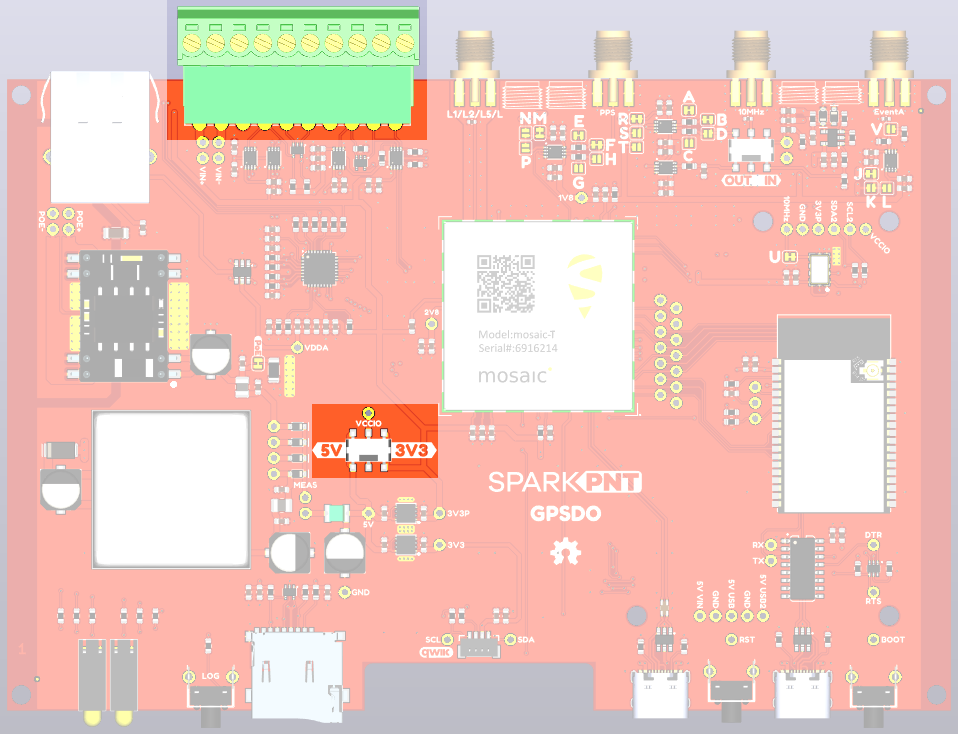{ width="400" }](./assets/img/hookup_guide/IO-PCB.png "Click to enlarge")
<figcaption markdown>I/O Screw Terminal Connections on the GPSDO PCB.</figcaption>
</figure>

These terminals are described in the tabs below. For more information on the I/O terminals, you can refer to the [schematic](./assets/board_files/schematic.pdf).

=== "External Power"

	The `VIN+` and `VIN-` terminals allow the GPSDO to be powered by an external DC power source - typically a 12V / 24V vehicle battery.

	

	| **Terminal** | 
**Function**
               |
	| :----------: | :------------------------------------------ |
	| **VIN+**     | External voltage: **Min: 9V**; **Max: 36V** |
	| **VIN-**     | Ground / Chassis / 0V                       |

	

	!!! info
		The DC-DC converter in the GPSDO provides 1.5kV isolation between `VIN+`/`VIN-` and **5V**/**GND**. There is no direct electrical connection between `VIN-` and `GND`.

	!!! warning "Ground Loop"
		If desired, users can link `VIN-` to the adjacent `GND` screw cage terminal. However, this will bypass the voltage isolation and could introduce an unwanted ground loop, particularly if the GNSS antenna ground (shield, 0V) is also connected to the chassis.

=== "GND"
	Ground / 0V or logic-low reference.

	!!! info
		The DC-DC converter in the GPSDO provides 1.5kV isolation between `VIN+`/`VIN-` and **5V**/**GND**. There is no direct electrical connection between `GND` and `VIN-`.

	!!! warning "Ground Loop"
		If desired, users can link `GND` to the adjacent `VIN-` screw cage terminal. However, this will bypass the voltage isolation and could introduce an unwanted ground loop, particularly if the GNSS antenna ground (shield, 0V) is also connected to the chassis.

=== "mosaic-T `COM2`"
	The mosaic-T UART COM2 connections are connected as follows:

	

	| **Terminal** | 
**Function**
          | **Notes**                                                     |
	| :----------: | :------------------------------------- | :------------------------------------------------------------ |
	| **RX**       | COM2 UART Receive - **Input**          |                                                               |
	| **TX**       | COM2 UART Transmit - **Output**        |                                                               |
	| **RTS**      | COM2 UART Request To Send - **Output** | The module drives this pin low when ready to receive data     |
	| **CTS**      | COM2 UART Clear To Send - **Input**    | Must be driven low when ready to receive data from the module |

	

	!!! tip
		The COM2 I/O voltage is set by the VCCIO voltage selection switch.

	!!! tip
		The **RX** and **CTS** inputs have weak (100K) pull-ups to VCCIO.

	!!! tip
		The **CTS** terminal can be configured as a **VCCIO** power output by soldering the jumper closed on the PCB.

=== "CTS"
	The CTS terminal can be configured as a **VCCIO** power output by soldering the jumper closed on the PCB.
	
	<figure markdown>
	[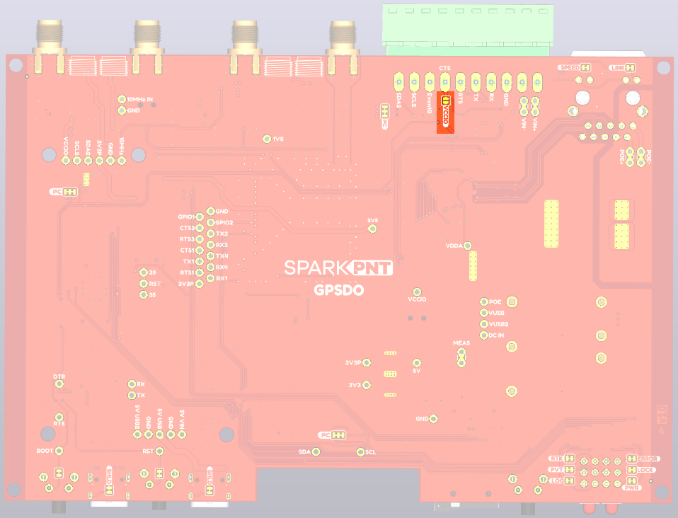{ width="400" }](./assets/img/hookup_guide/VCCIO-jumper.png "Click to enlarge")
	<figcaption markdown>VCCIO jumper.</figcaption>
	</figure>

	!!! tip
		Soldering the jumper closed will place the mosaic-T COM2 CTS into the high (not ready) state. Flow control (hardware handshaking) is not possible when the jumper is closed. Flow control is disabled by default. If needed, flow control can be (re)disabled through the web interface or by sending (e.g) **scs, COM2, baud115200, bits8, No, bit1, none**

	The VCCIO voltage can be set to 3.3V or 5V via the small internal slide switch highlighted below:

	<figure markdown>
	[{ width="400" }](./assets/img/hookup_guide/VCCIO.png "Click to enlarge")
	<figcaption markdown>VCCIO voltage selection switch.</figcaption>
	</figure>

	The `CTS` terminal can then be used as a power output or logic-high references. Likewise, the `GND` terminal can be used for power return or as logic-low references.

	

	| **Terminal** | 
**Function**
                   |
	| :----------: | :---------------------------------------------- |
	| **CTS**      | 3.3V or 5V power output or logic-high reference |
	| **GND**      | Ground / 0V or logic-low reference              |

	

	!!! info
		The default position of the `VCCIO` switch is **3.3V**.

	!!! tip
		The `CTS` and `GND` pins could be used to power (e.g.) a LoRa module. When VCCIO is 3.3V, we recommend limiting the current draw from `VCCIO` to **200mA** maximum. The upstream 3.3V regulator is rated at 600mA but it also provides power for the mosaic-T and Ethernet PHY. When VCCIO is set to 5V, the current draw can be higher - the suggested maximum is **500mA**.

=== "EVENT B"
	The mosaic-T **EVENTB** input can be used to mark or timestamp external events:

	

	| **Terminal** | **Function**    |
	| :----------: | :-------------: |
	| **EVENTB**   | Event B : Input |

	

	!!! tip
		The EVENT B voltage level is set by the VCCIO voltage selection switch.

	!!! tip
		The EVENT B input is pulled low internally. Pull up to VCCIO to trigger an event.

	!!! tip
		An easy way to observe the events is with **RxTools** \ **RxControl** \ **Expert Console** (under **Tools**) \ **ExEvent** tab:

		<figure markdown>
		[{ width="400" }](./assets/img/hookup_guide/EVENT.png "Click to enlarge")
		<figcaption markdown>Capturing external events from EVENTA and EVENTB.</figcaption>
		</figure>

=== "SCL2 & SDA2"
	The SCL2 and SDA2 screw terminals provide access to the TCXO I2C bus, allowing the user to connect an external configurable TCXO if desired. The I2C voltage level is set by the VCCIO switch: 3.3V or 5V. The provided firmware supports the SiTime SiT5358; the user will need to modify the firmware to support additional osciillators.

	

	| **Terminal** | **Function**              |
	| :----------: | :-----------------------: |
	| **SCL2**      | I2C Clock : Bidirectional |
	| **SDA2**      | I2C Data : Bidirectional |

	

	!!! tip
		The I2C voltage is set by the VCCIO voltage selection switch.

## Status LEDs
There are six status LEDs on the GPSDO:

* `PWR` - Power *(Red)*
	* Illuminates when power is applied
* `LOG` - &micro;SD Logging *(Red)*
	* Solid Red - &micro;SD card is mounted
	* Blinking Red - Data is being logged
	* Off - &micro;SD is dismounted or not present
* `LOCK` - Oscillator Lock *(Green)*
	* The TCXO is locked to the correct frequency - as reported by **PVTGeodetic RxClkBias**
	* Connected to ESP32 GPIO pin 33
* `PVT` - Position Velocity Time *(Green)*
	* Solid Green - The mosaic-T has valid Position, Velocity and Time
	* Off - Satellite signal not present or acquired
* `ERROR` - GNSS Error *(Yellow)*
	* The GNSS Error status - as reported by **PVTGeodetic Error**
	* Connected to ESP32 GPIO pin 32
* `RTK` - Real-Time Kinematic *(Yellow)*
	* Solid Yellow - The mosaic-T has an RTK Fixed solution
	* Blinking Yellow - The mosaic-T has an RTK Float solution
	* Off - No RTK solution

<figure markdown>
[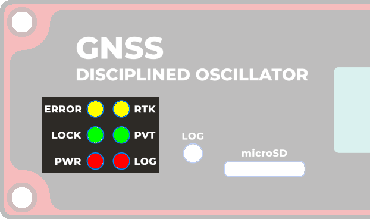{ width="400" }](./assets/img/hookup_guide/LEDs.png "Click to enlarge")
<figcaption markdown>
The status indicator LEDs on the GPSDO.
</figcaption>
</figure>

<figure markdown>
[{ width="400" }](./assets/img/hookup_guide/LEDs-PCB.png "Click to enlarge")
<figcaption markdown>
The status indicator LEDs on the GPSDO PCB.
</figcaption>
</figure>

## OLED Display
The GPSDO has a 128x64 pixel OLED display, controlled by the ESP32 via I2C. After some initial diagnostic messages, the display will show position, time and other data from the mosaic-T **PVTGeodetic**, **ReceiverTime** and **IPStatus** SBF blocks.

<figure markdown>
[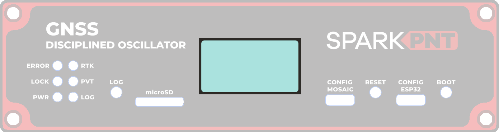{ width="750" }](./assets/img/hookup_guide/OLED3.png "Click to enlarge")
<figcaption markdown>
The OLED display on the GPSDO.
</figcaption>
</figure>

<figure markdown>
[{ width="250" }](./assets/img/hookup_guide/OLED-Fugro.png "Click to enlarge")
<figcaption markdown>
[OLED display (PNG)](./assets/img/hookup_guide/OLED-Fugro.png) for the GPSDO.
</figcaption>
</figure>

* Date & Time : YYYY/MM/DD HH:MM:SS from ReceiverTime
* **IP**        : nnn.nnn.nnn.nnn from IPStatus IPAddress
	* When [TCP console access](./software_overview.md#tcp-server-ips1) is enabled, the TCP port number is also displayed.
* **Lat**       : Latitude from PVTGeodetic (Degrees)
* **Long**      : Longitude from PVTGeodetic (Degrees)
* **Sys**       : TimeSystem from PVTGeodetic
	* GPS, Galileo, GLONASS, BeiDou, QZSS, Fugro
* **Error**     : Error from PVTGeodetic
	* None, Measurements, Ephemerides, DOP, Residuals, Convergence, Outliers, Export, Differential, Base, Ambiguities
* **Fine**      : FINETIME from ReceiverTime
	* False, True
* **PPS**      : Indicates if the Pulse-Per-Second signal is being generated
	* Off, On
	* PPS is only generated once the RxClkBias has achieved the required accuracy
* **Bias**      : RxClkBias from PVTGeodetic (ms/us/ns)

The display is updated on arrival of the **ReceiverTime** message. You may see a small lag between the display and the actual time system time, but it will be minimal.

## Buttons
There are three buttons on the GPSDO: ++"RESET"++, ++"BOOT"++, and ++"LOG"++.

<figure markdown>
[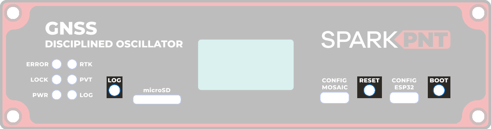{ width="750" }](./assets/img/hookup_guide/Buttons.png "Click to enlarge")
<figcaption markdown>Buttons on the GPSDO.</figcaption>
</figure>

<figure markdown>
[{ width="400" }](./assets/img/hookup_guide/Buttons-PCB.png "Click to enlarge")
<figcaption markdown>Buttons on the GPSDO PCB.</figcaption>
</figure>

=== ":septentrio-logo:&nbsp;mosaic-T: Data Logging"
	Once a [logging stream](#sd-socket) is defined, users can control the data logging operation through the ++"LOG"++ button.

	* A short press of the ++"LOG"++ button *(< 5s)* toggles data logging to the SD card on and off.
		* The red `LOG` LED will flash while logging is taking place.
	* Holding the ++"LOG"++ button for more than 5 seconds *(> 5s)* and then releasing it, will force the board to:
		* Unmount the SD card if it was mounted
		* Mount the SD card if it was unmounted

	!!! tip "Instructional Video"
		:material-youtube: [How to log data to the SD card of the Septentrio mosaic receiver module](https://youtu.be/Y9tvOebnoxk)

=== ":espressif-logo:&nbsp;ESP32: Reset"
	The ++"RESET"++ button allows users to reset the firmware running on the ESP32-WROVER module without disconnecting the power.

=== ":espressif-logo:&nbsp;ESP32: Boot Control"
	The ++"BOOT"++ button can be used to force the ESP32 into the serial bootloader. Holding down the ++"BOOT"++ button, while connecting the GPSDO to a computer through its USB-C connector or resetting the board will cause it to enter the <a href="https://docs.espressif.com/projects/esptool/en/latest/esp32/advanced-topics/boot-mode-selection.html#manual-bootloader">Firmware Download mode</a>. The ESP32 will remain in this mode until it power cycles (happens automatically after uploading new firmware) or the ++"RESET"++ button is pressed.

	1. Hold the ++"BOOT"++ button down.
	2. Reset the MCU.
		* While unpowered, connect the board to a computer through the USB-C connection.
		* While powered, press the ++"RESET"++ button.
	3. Release the ++"BOOT"++ button.
	4. After programming is completed, reboot the MCU.
		* Press the ++"RESET"++ button.
		* Power cycle the board.

## Jumpers

??? note "Never modified a jumper before?"
	Check out our <a href="https://learn.sparkfun.com/tutorials/664">Jumper Pads and PCB Traces tutorial</a> for a quick introduction!

	

	-   <a href="https://learn.sparkfun.com/tutorials/664">
		<figure markdown>
		
		</figure>

		---

		**How to Work with Jumper Pads and PCB Traces**</a>

	

There are several jumpers on the RTK moasic-T PCB which can be used to (e.g.) disable the LEDs or allow measurement of the board's current draw.

<figure markdown>
[{ width="400" }](./assets/img/hookup_guide/Jumpers-top.png "Click to enlarge")
<figcaption markdown>
The jumpers on the top of the GPSDO PCB.
</figcaption>
</figure>

<figure markdown>
[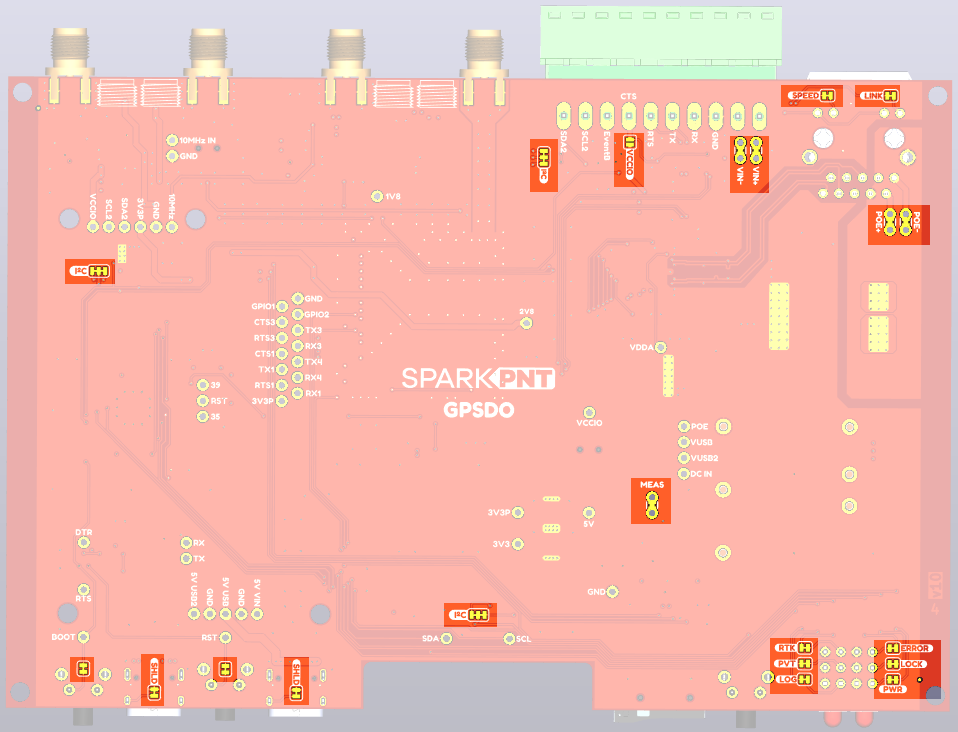{ width="400" }](./assets/img/hookup_guide/Jumpers-bottom.png "Click to enlarge")
<figcaption markdown>
The jumpers on the bottom of the GPSDO PCB.
</figcaption>
</figure>

=== "Top"
	* **POE** - This jumper can be used to disconnect the Power-over-Ethernet (PoE) module 50&ohm; load.
		* The PoE module has a minimum load of 200mA. We included the 50&ohm; load to ensure this is met. If you can ensure this by other means, open this jumper to disconnect the load.
	* **Voltage Configuration: A-V**
		* The jumper links A-V can be used to configure the voltage levels and impedance of the SMA connections. Please refer to the [schematic](./assets/board_files/schematic.pdf) for additional information.
		* To configure the 10MHz output for 50 Ohms: open jumper **A** and close jumper **D**.
			* Jumper **A** is closed by default. Open it to select 50 Ohms for the 10MHz output.
			* Jumper **B** is closed by default. It could be used to isolate the gate driving the 10MHz output. Advanced use only.
			* Jumper **C** is open by default. It could be used to select the alternate gate for the 10MHz CMOS output. Advanced use only.
			* Jumper **D** is open by default. Close it to select 50 Ohms for the 10MHz output.
		* To configure the PPS output for 50 Ohms: open jumper **E** and close jumper **H**.
			* Jumper **E** is closed by default. Open it to select 50 Ohms for the PPS output.
			* Jumper **F** is closed by default. It could be used to isolate the gate driving the PPS output. Advanced use only.
			* Jumper **G** is open by default. It could be used to select the alternate gate for the PPS CMOS output. Advanced use only.
			* Jumper **H** is open by default. Close it to select 50 Ohms for the PPS output.
		* Jumpers J,K,L configure the voltage of the Event A input.
			* Jumper **J** is closed by default. It selects VCCIO as the Event A input voltage.
			* Jumper **K** is open by default. Open jumper J and close jumper K to configure Event A for 2.8V.
			* Jumper **L** is open by default. Open jumper J and close jumper L to configure Event A for 1.8V.
		* Jumpers M,N,P configure the voltage of the PPS output.
			* Jumper **M** is closed by default. It selects VCCIO as the PPS output voltage.
			* Jumper **N** is open by default. Open jumper M and close jumper N to configure PPS for 2.8V.
			* Jumper **P** is open by default. Open jumper M and close jumper P to configure PPS for 1.8V.
		* Jumpers R,S,T configure the voltage of the 10MHz output.
			* Jumper **R** is closed by default. It selects VCCIO as the 10MHz output voltage.
			* Jumper **S** is open by default. Open jumper R and close jumper S to configure 10MHz for 2.8V output.
			* Jumper **T** is open by default. Open jumper R and close jumper T to configure 10MHz for 1.8V output.
		* Jumper **U** can be used to isolate the on-board 10MHz TCXO.
			* Open jumper U when connecting an alternate TCXO via the breakout pads on the PCB. Advanced use only.
		* To configure the Event A input for 50 Ohms: close jumper **V**.
			* Jumper **V** is open by default. Close it to select 50 Ohms for the Event A input.

=== "Bottom"
	* LED Jumpers
		* **LINK** - open this jumper to disable the Ethernet Link LED.
		* **SPEED** - open this jumper to disable the Ethernet Speed LED.
		* **RTK** - open this jumper to disable the mosaic-T Real-Time Kinetic LED.
		* **PVT** - open this jumper to disable the mosaic-T Position Velocity Time LED.
		* **LOG** - open this jumper to disable the mosaic-T Log LED.
		* **ERROR** - open this jumper to disable the GNSS error LED.
		* **LOCK** - open this jumper to disable the TCXO lock LED.
		* **PWR** - open this jumper to disable the Power LED.
	* Button Jumpers
		* **BOOT** - open this jumper to disconnect the ESP32 BOOT pushbutton.
		* **RESET** - open this jumper to disconnect the ESP32 RESET pushbutton.
	* **SHLD** (x2) - open these jumpers to isolate the USB-C connector shield from GND.
	* **I2C** (x2) - open these dual jumpers to disconnect the pull-ups for the I2C buses.
		* Note: there are separate jumpers for the two I2C buses: OLED (Qwiic); and the SiTime TCXO.
	* **VIN+** and **VIN-**
		* Open these jumpers if you wish to isolate (disconnect) the external DC power terminals. The breakout pads can then be used to feed in power from an alternate source.
	* **POE+** and **POE-**
		* Open these jumpers if you wish to isolate (disconnect) the Power-over-Ethernet pins on the MOSAIC Ethernet magjack. The breakout pads can then be used to feed in power from an alternate source.
	* **VCCIO**
		* The **VCCIO** jumper can be soldered closed to connect the **CTS** screw terminal to VCCIO. **CTS** can then be used as a power output. The voltage is set by the VCCIO slide switch.
	* **MEAS**
		* Open the **MEAS** jumper if you wish to measure the total current drawn by the GPSDO, or (e.g.) wish to add an ON/OFF switch. The breakout pads can then be used to attach a multimeter or a mechanical power switch.
		* **MEAS** is _upstream_ of the two 3.3V regulators and _downstream_ of the four power source combination and protection diodes.
