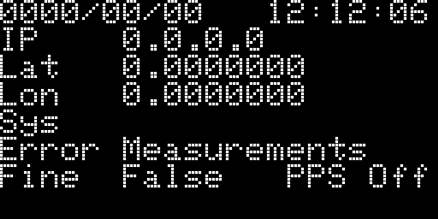
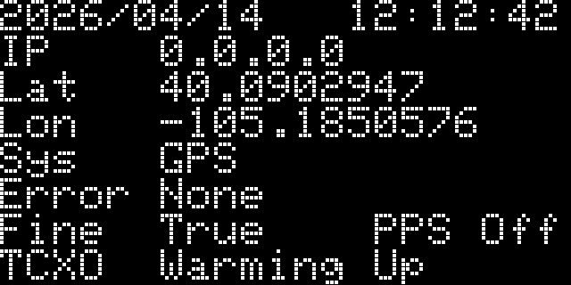
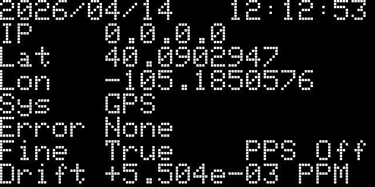
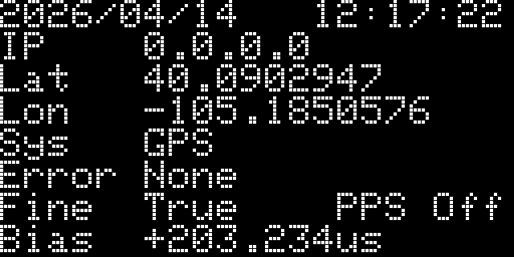
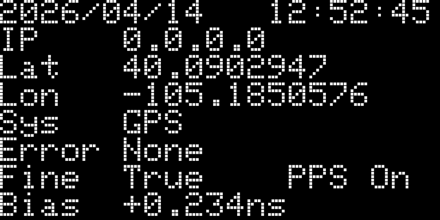

As the name suggests, the SparkPNT GNSS Disciplined Oscillator (GNSSDO) and GNSS Disciplined Oscillator Plus (GNSSDO+) are very precise 10MHz disciplined oscillators.
Inside, the Septentrio mosaic-T GNSS provides all-in-view satellite tracking: multi-constellation, and multi-frequency. It has dedicated timing features for time and clock synchronisation. Using the clock bias measurements from the mosaic-T, which it calculates by comparing the internal 10MHz clock to those of the GNSS satellites, the GNSSDO(+) is able to discipline (adjust) the frequency of the digitally-controlled oscillator to bring it as close to 10MHz as possible. Once the frequency has been adjusted, the accuracy of the mosaic-T's Pulse Per Second output is: better than 5ns; and better that 1ns with an optional subscription to [Fugro's AtomiChron](./atomichron.md) timing service. Take two GNSSDOs, place them anywhere on the planet and you can be confident that their time pulses are aligned to within 5ns or 1ns of each other...

The mosaic-T PVT (Position Velocity Time) messages report the Receiver clock bias (RxClkBias) relative to the GNSS time system. If RxClkBias is positive, the receiver time is ahead of the GNSS system time. By reducing the oscillator frequency (ever so slightly), the clock bias can be reduced towards zero. If RxClkBias is negative, the oscillator frequency needs to be increased to minimise the bias. This is achieved by controlling the oscillator frequency using a classic Phase-Locked Loop, with Proportional and Integral (PI) control terms. On GNSSDO+, we also include a Derivative term (PID) in the feedback loop.

### GNSS Signal Acquisition and Warm Up

When you turn the GNSSDO on, it needs to do two things: acquire a GNSS signal (so that the clock bias can be measured), and warm up the oscillator.

If you connect to the GNSSDO(+)'s CONFIG ESP32 USB port and open a terminal emulator / serial console, you will see diagnostic data which tells you the status of the GNSSDO. You can find more information on how to do that in the [quick start guide](./quick_start.md#esp32-usb-c) and in the [software overview](./software_overview.md#print-conditions-periodic-messages). The **Mode** column tells you which mode the GNSSDO is in.

While the mosaic-T is acquiring a GNSS signal, the OLED display will show an Error such as "Measurements" or "Ephemerides":

<figure markdown>
[{ width="250" }](./assets/img/hookup_guide/OLED_1.png "Click to enlarge")
<figcaption markdown>OLED showing Error Measurements.</figcaption>
</figure>

In the serial console CSV messages, the **Mode** will be shown as **CONFIGURED**. This indicates that the GNSS has been configured, but that it does not yet have a time solution.

Once the GNSS has acquired a signal and has a (preliminary) time solution: Error will change to "None"; Fine will change to "True" (indicating that the receiver time-of-week is within bounds).

On GNSSDO+, the firmware will now go into **Mode** **WARMUP**. It can take approximately 10 minutes for the STP3593LF double-oven oscillator temperature to stabilise.

<figure markdown>
[{ width="250" }](./assets/img/hookup_guide/OLED_2.png "Click to enlarge")
<figcaption markdown>OLED showing TCXO Warming Up.</figcaption>
</figure>

Warm-up is complete when the **Temp_Smooth** reaches the required 0.01°C stability.

### Frequency Locking

**Note:** frequency locking was introduced with GNSSDO firmware v3.0

After initial warm-up, the temperature-controlled oscillator is neither frequency-locked nor phase-locked. The first step is to ensure it is running at the correct frequency. This is acheived using a simple frequency-locked loop. The _change_ in the Bias (RxClkBias) is used as the error term for the PI loop. The _change_ in the Bias is driven to zero, by altering the oscillator frequency.

During this state, the OLED display will show "Drift" followed by the oscillator drift in PPM:

<figure markdown>
[{ width="250" }](./assets/img/hookup_guide/OLED_3.png "Click to enlarge")
<figcaption markdown>OLED showing Drift.</figcaption>
</figure>

The **Mode** will be **FINETIME** during this state. I.e. a fine time solution has been obtained, and the firmware is now in the process of frequency locking.

The firmware will stay in this state until the required bias stability has been achieved. In the CSV messages, **Bias_Smooth** will reach the required 1.0e-10. The reported "Drift" will reach ~1e-05 PPM at about the same time.

### Phase Locking (Frequency Ramping)

**Note:** phase locking (frequency ramping) was introduced with GNSSDO firmware v3.0

Once the _change_ in the Bias has been driven close to zero, we can be confident that the oscillator frequency is correct. (If the frequency was not correct, the Bias would change.) The next step is to ensure the oscillator phase is correct.

In v3.0 of the GNSSDO firmware, we set the mosaic-T **setClockSyncThreshold** (scst) `StartupSync` parameter to `Off`. In previous versions of the firmware, this was set to `On`. This ensured a small residual Bias when entering Finetime, but it also introduced an uncertainty in the PPS output with respect to the 10MHz clock.The only way to remove that uncertainty is to set the `StartupSync` parameter to `Off`. But, this means the initial clock Bias can be as large 500us.

You may be lucky and there may be only a small Bias left to remove after Frequency Locking. Worst case, there is a Bias approaching 500us to remove.

The large Bias is removed by ramping the oscillator frequency one way and then back the other way. If the initial bias is, say, +400us, the oscillator frequency must be ramped down, held, and then ramped up again. The firmware accelerates the change in frequency at: 1ns/s on GNSSDO, and 0.5ns/s on GNSSDO+. This helps the PI loop to retain control and avoids blowing up the integrator.

Ramping the frequency is a slow process. It can take over 30 minutes, depending on the size of the initial error.

The OLED display will display the clock Bias. You can watch the Bias change, slowly at first, reaching a limit of: 500ns/s on GNSSDO; and 250ns/s on GNSSDO+.

<figure markdown>
[{ width="250" }](./assets/img/hookup_guide/OLED_4.png "Click to enlarge")
<figcaption markdown>OLED showing Bias in microseconds.</figcaption>
</figure>

The **Mode** will be **FREQUENCY_LOCK** during this state. I.e. frequency lock has been achieved, and the firmware is now in the process of phase locking.

The firmware will stay in this state until the ramps are complete. In the CSV messages, you can watch:

- **Rate** increase then decrease at: 1ns/s on GNSSDO; 0.5ns/s on GNSSDO+
- **Rate_Held** is the capped rate: 500ns/s on GNSSDO; 250ns/s on GNSSDO+
- **Setpoint** is the target Bias, set by the ramps
- **Turn** is the turn-around point, from the 'up' ramp to the 'down' ramp (this value is absolute - always positive)
- **Error** is the difference between the **Setpoint** and the RxClkBias
- **Repeat** is the number of times the ramps have been repeated: a minimum of once on GNSSDO; twice on GNSSDO+

The firmware will exit **Mode** **FREQUENCY_LOCK** and enter **PHASE_LOCK** if the residual bias is low enough on completion of the 'down' ramp: 100ns on both GNSSDO and GNSSDO+

### Phase Lock

When the oscillator frequency and phase are correct, the firmware continues to drive the Bias towards zero using a PI(D) loop. The residual Bias should be within (approximately) +/-100ps on GNSSDO and +/-10ps GNSSDO+. Please note that the reported Bias is relative, not absolute. The true absolute accuracy will be higher than this, but within the quoted 5ns or 1ns with Fugro AtomiChron.

The **Mode** will be **PHASE_LOCK** during this state.

PPS output is started when the firmware enters this state for the first time (since power-on).

<figure markdown>
[{ width="250" }](./assets/img/hookup_guide/OLED_5.png "Click to enlarge")
<figcaption markdown>OLED showing PPS On.</figcaption>
</figure>

### Error States

If the GNSS detects an Error, the firmware will: report the Error on the OLED display and in the CSV **Error** column; maintain the oscillator frequency until the error is cleared. The Error LED will also illuminate.

Once the error is cleared, the firmware will return to **FREQUENCY_LOCK**, nudge the oscillator frequency if required, and return to **PHASE_LOCK** as promptly as possible. The PPS output is not paused during error states; once started in **PHASE_LOCK**, PPS output is not stopped.

For more details, please refer to the [Software Control Loop](./oscillator.md#software-control-loop) section.

