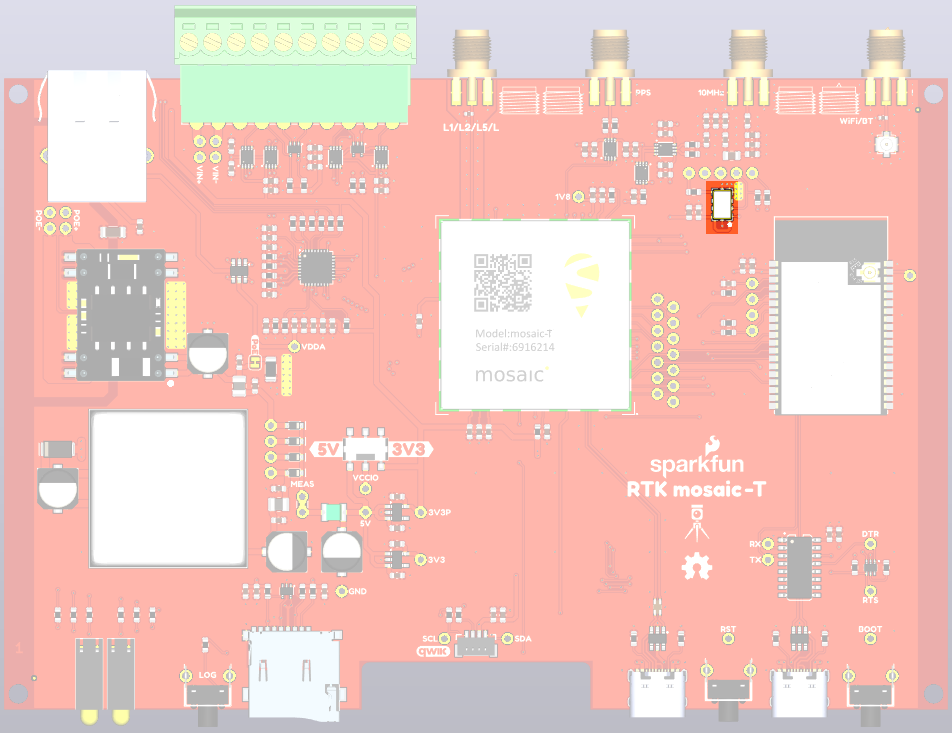
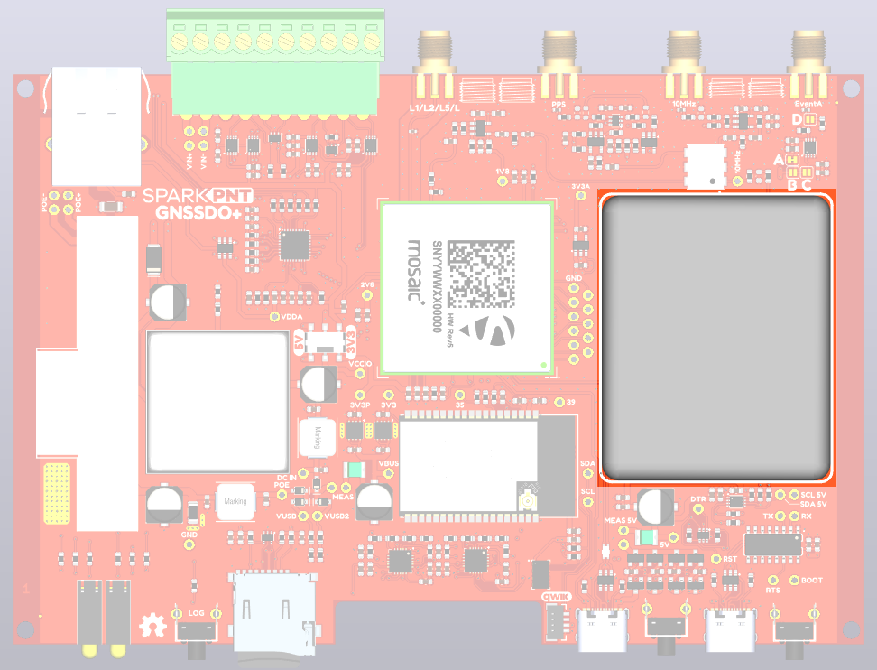

## GNSSDO: SiTime SiT5358 Disciplined Oscillator

<figure markdown>
[{ width="750" }](./assets/img/hookup_guide/TCXO-PCB.png "Click to enlarge")
<figcaption markdown>SiT5358 TCXO Oscillator.</figcaption>
</figure>

For excellent frequency accuracy and stability, the SparkPNT GNSSDO utilizes a SiTime SiT5358 Digitally-Controlled Temperature-Controlled Crystal Oscillator (DCTCXO).
The SiT5358 is a precision MEMS Super-TCXO optimized for ±50 ppb stability from -40°C to 105°C. Engineered for best dynamic performance, it is ideal for high reliability telecom, wireless and networking, industrial, precision GNSS and audio/video applications.

- SiT5358AI-FS033IT-10.000000 10MHz DCTCXO
- ±50ppb stability
- ±1ppb/°C frequency slope
- ±58ppb typical 20-year aging
- [Allan Deviation](./assets/img/hookup_guide/Allan_Deviation.jpg) approaches 1E-14 at 10000 seconds with AtomiChron enabled
- Digital frequency pulling via I²C
- Operating temperature: -40 to 85 °C (Industrial)

The SiT5358 is interfaced to the mosaic-T through a level-shifting buffer, replacing the mosaic's internal oscillator and allowing the oscillator frequency to be tuned (disciplined) under software control. The 10 MHz SMA output is generated by a duplicate level-shifter to ensure an equal delay and identical thermal phase changes.

## GNSSDO+: Rakon STP3593LF Double-Oven Disciplined Oscillator

<figure markdown>
[{ width="750" }](./assets/img/hookup_guide/TCXO-PCB_GNSSDO+.png "Click to enlarge")
<figcaption markdown>STP3593LF OCXO Oscillator.</figcaption>
</figure>

For the best frequency accuracy, stability and holdover, the SparkPNT GNSSDO+ utilizes a Rakon STP3593LF Double-Oven Crystal Oscillator (OCXO).
The STP3593LF is a High End Telecom OCXO with embedded module, typically found in 5G Grand Master or Stratum-2 clocks.

- STP3593LF Double-Oven OCXO - ROX5242T1N Family
- Frequency Stability better than 50ppt peak to peak over operating range from -32°C to +70°C
- Frequency calibration +/- 50ppb at +25°C ± 2°C
- Frequency Stability Vs. Time (Aging): slope per day ± 0.2 ppb
- SSB Phase Noise (typical): -100 at 1Hz; -155 at 1kHz; -170 at 1MHz
- [Allan Deviation](./assets/img/hookup_guide/GNSSDO+_Allan_Deviation.png) below 1E-14 at 10000 seconds with AtomiChron enabled
- Digital frequency pulling via I²C
- Operating temperature: -32 to 70 °C

The STP3593LF is interfaced to the mosaic-T through a level-shifting buffer, replacing the mosaic's internal oscillator and allowing the oscillator frequency to be tuned (disciplined) under software control. The 10 MHz SMA output is generated by a duplicate level-shifter to ensure an equal delay and identical thermal phase changes.

The PPS output is aligned to the 10MHz clock by a 74LVC1G175 flip-flop (U15). Consult page 7 of the [GNSSDO+ schematic](./assets/board_files/SparkPNT_GNSSDO_Plus_schematic.pdf) for more details

## Software Control Loop

The oscillator is interfaced to the mosaic-T according to Appendix D of the mosaic Hardware Manual: "mosaic-Based Disciplined Clock".

The ESP32 is interfaced to three of the mosaic-T's COM (UART) ports: `COM1`, `COM3`, and `COM4`. The ESP32 configures the mosaic-T via `COM4`. `COM1` is dedicated as an output port for the SBF blocks used to tune the oscillator frequency. `COM3` is used to divert the ESP32 serial console to TCP.

When the firmware boots, the mosaic-T is configured as follows:

```
setPPSParameters, off
setClockSyncThreshold, usec500, off
setSBFGroups, Group1, PVTGeodetic+ReceiverTime
setSBFOutput, Stream1, COM1, Group1, sec1
setSBFOutput, Stream2, COM1, IPStatus+FugroTimeOffset, OnChange
setEthernetMode, on
setPVTMode, Static, , auto
exeCopyConfigFile, Current, Boot
```

These commands configure the mosaic so that it: starts-up with the PPS pulses disabled; performs an initial synchronization to GNSS time; and outputs the **PVTGeodetic** and **ReceiverTime** blocks on COM1 at 1Hz. **IPStatus** is output each time one or more IP parameters change. With a Fugro Atomichron subscription, the **FugroTimeOffset** message will be generated each time one of the clock biases changes.

**Note:** from GNSSDO firmware version 3.0, the firmware no longer uses **setClockSyncThreshold** (scst) `StartupSync`. `StartupSync` is off.
This prevents a shift in PPS with respect to the 10MHz clock, but it does mean that the initial bias error can be up to 500us and it can take a long
time (~30 minutes) to get the bias down to zero by ramping the frequency.
The firmware no longer performs a soft reset if the bias is excessive on startup.

The firmware monitors the message blocks on `COM1`. The `ERROR` LED follows the **PVTGeodetic Error** code. The LED is extinguished when **Error** is zero.

In STATE_GNSS_CONFIGURED:

- The firmware waits for the **ReceiverTime** `FINETIME` bit to be set, indicating the **setClockSyncThreshold** `Threshold` (usec500) has been achieved

In STATE_TCXO_WARMUP (GNSSDO+ only):

- The firmware waits for `tcxoMinWarmup_s` and for the OCXO temperature to become stable

In STATE_GNSS_FINETIME:

- The firmware disciplines the TCXO / OCXO frequency in a simple frequency locked loop
- The firmware exits this state when the change in the `tcxoClockBias_ms` (`RxClkBias`) is better than the specified `rxStabilityForFrequencyLock`
- The PI loop uses `PkSteer` and `IkSteer` when frequency locking

In STATE_GNSS_FREQUENCY_LOCK:

- The TCXO / OCXO bias is driven towards zero
- The initial bias error can be up to 500us, so we need to ramp the TCXO frequency one way ('up') and then back again ('down')
- We slowly accelerate the change in frequency, maintain it at `tcxoRampRateLimit_sps`, then decelerate
- The acceleration is set by the `tcxoRampStepSize_s`: 0.5ns/s for the STP3593; the SiT5358 can accelerate faster
- The ramps help to avoid blowing up the integrator
- When the ramps are complete, the `tcxoClockBias_ms` (`RxClkBias`) is re-checked
- This state is repeated if the bias is still excessive (> `rxPhaseErrorLimit_s`)
- The PI loop uses `PkRamp` and `IkRamp` when following the ramps

In STATE_GNSS_PHASE_LOCK:

- The LOCK LED will be illuminated when the firmware is in STATE_GNSS_PHASE_LOCK
- PPS output will be started when entering STATE_GNSS_PHASE_LOCK for the first time
- This state uses a conventional PLL to drive the `tcxoClockBias_ms` (`RxClkBias`) to zero
- The P and I terms are `Pk` and `Ik`
- When entering STATE_GNSS_PHASE_LOCK from STATE_GNSS_FREQUENCY_LOCK, the P and I terms are ramped from `PkRamp` and `IkRamp` to `Pk` and `Ik` over `phaseLockPIRampTime_s` (120s)
    - This helps to avoid shocking the PI loop and sending the bias off for a walk...

The firmware monitors the **PVTGeodetic RxClkBias** (as 64-bit float in milliseconds). When **RxClkBias** is positive, receiver time is ahead of system time and the oscillator frequency should be reduced. When **RxClkBias** is negative, receiver time is behind system time and the oscillator frequency should be increased. The firmware will adjust the oscillator frequency via its Digital Frequency Control register accordingly. As per Appendix D, the frequency will be changed by no more than 3ppb per second.

The Proportional (P) and Integral (I) terms can be adjusted via the [ESP32 firmware settings](./software_overview.md#configure-operation).

The Pulse-Per-Second parameters can be configured by the user through the [ESP32 firmware settings](./software_overview.md#configure-operation): interval, polarity, delay, time scale, max sync age, pulse width.

```
setPPSParameters, Interval, Polarity, Delay, TimeScale, MaxSyncAge, PulseWidth
```

Should **PVTGeodetic Error** indicate an error (i.e. become non-zero), the loop will continue but no changes will be made to the oscillator frequency until the error is cleared.
