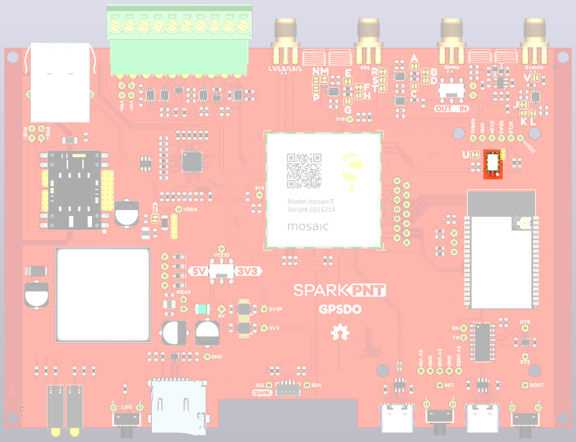

## SiTime SiT5358 Disciplined Oscillator

<figure markdown>
[{ width="750" }](./assets/img/hookup_guide/TCXO-PCB.png "Click to enlarge")
<figcaption markdown>SiT5358 TCXO Oscillator.</figcaption>
</figure>

For the best frequency accuracy, stability and holdover, the RTK mosaic-T utilizes a SiTime SiT5358 Digitally-Controlled Temperature-Controlled Crystal Oscillator (DCTCXO).
The SiT5358 is a precision MEMS Super-TCXO optimized for ±50 ppb stability from -40°C to 105°C. Engineered for best dynamic performance, it is ideal for high reliability telecom, wireless and networking, industrial, precision GNSS and audio/video applications.

* SiT5358AI-FS033IT-10.000000 10MHz DCTCXO
* ±50ppb stability
* ±1ppb/°C frequency slope
* ±58ppb typical 20-year aging
* Digital frequency pulling via I²C
* Operating temperature: -40 to 85 °C (Industrial)

The SiT5358 is interfaced to the mosaic-T through a level-shifting buffer, replacing the mosaic's internal oscillator and allowing the oscillator frequency to be tuned (disciplined) under software control. The 10 MHz SMA output is generated by a duplicate level-shifter to ensure an equal delay, and filtered through a 3rd order Butterworth bandpass filter.

## Software Control Loop

The SiT5358 is interfaced to the mosaic-T according to Appendix D of the mosaic Hardware Manual: "mosaic-Based Disciplined Clock".

The ESP32 is interfaced to two of the mosaic-T's COM (UART) ports: COM1 and COM4. The ESP32 configures the mosaic-T via COM4. COM1 is dedicated as an output port for the SBF blocks used to tune the oscillator frequency.

When the firmware boots, the mosaic-T is configured as follows:

* **setPPSParameters, off**
* **setClockSyncThreshold, usec500, on**
* **setSBFGroups, Group1, PVTGeodetic+ReceiverTime**
* **setSBFOutput, Stream1, COM1, Group1, sec1**
* **setSBFOutput, Stream2, COM1, IPStatus+FugroTimeOffset, OnChange**
* **exeCopyConfigFile, Current, Boot**

These commands configure the mosaic so that it: starts-up with the PPS pulses disabled; performs an initial precise synchronization to GNSS time; and outputs the **PVTGeodetic** and **ReceiverTime** blocks on COM1 at 1Hz. **IPStatus** is output each time one or more IP parameters change. With a Fugro Atomichron subscription, the **FugroTimeOffset** message will be generated each time one of the clock biases changes.

The firmware monitors the message blocks on COM1. The **ERROR** LED follows the **PVTGeodetic Error** code. The LED is extinguished when **Error** is zero.

The firmware waits until the **ReceiverTime SyncLevel FINETIME** bit is set, indicating that the receiver time initialization is complete. Once the **FINETIME** bit is set, it remains set until the next reset of the receiver.

The firmware then monitors the **PVTGeodetic RxClkBias** (as 64-bit float in milliseconds). When **RxClkBias** is positive, receiver time is ahead of system time and the oscillator frequency should be reduced. When **RxClkBias** is negative, receiver time is behind system time and the oscillator frequency should be increased. The firmware will adjust the SiT5358 oscillator frequency via the 26-bit Digital Frequency Control register accordingly. As per Appendix D, the frequency will be changed by no more than 3ppb per second.

The Proportional (P) and Integral (I) terms can be adjusted via the ESP32 firmware settings.

The **LOCK** LED will illuminate and PPS pulses will be generated when RxClkBias is less than 10ns. The OLED will show **PPS On** when pulses are being generated.

* **setPPSParameters, Interval, Polarity, Delay, TimeScale, MaxSyncAge, PulseWidth**

The 10ns lock threshold / limit can be changed by the user through the ESP32 USB-C interface and saved in non-volatile memory.

The Pulse-Per-Second parameters can also be configured by the user through the USB-C interface: interval, polarity, delay, time scale, max sync age, pulse width.

Should **PVTGeodetic Error** indicate an error (i.e. become non-zero), the loop will continue but no changes will be made to the oscillator frequency until the error is cleared.

Occasionally, the initial mosaic-T clock bias can be excessive - microseconds rather than nanoseconds. The firmware detects this and will restart the GNSS to achieve a better lock. You will see **Bad RxClkBias --- Restarting** appear on the OLED when this happens. The threshold for this can be adjusted via the ESP32 firmware settings.

## Fugro AtomiChronⓇ

For the ultimate in clock accuracy, you can subscribe to Fugro's AtomiChron service. Corrections can be delivered via L-Band or IP (Ethernet). AtomiChron allows the mosaic-T to achieve better than 1ns timing accuracy.

Without an AtomiChron subscription, the firmware will use the composite GNSS **RxClkBias** from **PVTGeodetic** to discipline the TCXO frequency. With AtomiChron, you have the option to use the individual GPS or Galileo clock bias from **FugroTimeOffset** over the Fugro composite bias.

## OLED Display

The 128x64 OLED will display eight lines of text:

* Date & Time : YYYY/MM/DD HH:MM:SS from ReceiverTime
* **IP**        : nnn.nnn.nnn.nnn from IPStatus IPAddress
* **Lat**       : Latitude from PVTGeodetic (Degrees)
* **Long**      : Longitude from PVTGeodetic (Degrees)
* **Sys**       : TimeSystem from PVTGeodetic (GPS, Galileo, GLONASS, BeiDou, QZSS, Fugro)
* **Error**     : Error from PVTGeodetic (None, Measurements, Ephemerides, DOP, Residuals, Convergence, Outliers, Export, Differential, Base, Ambiguities)
* **Fine**      : FINETIME from ReceiverTime (False, True)
* **PPS**       : Indicates if PPS is active (Off, On)
* **Bias**      : RxClkBias from PVTGeodetic / FugroTimeOffset (ms/us/ns)

The display is updated on arrival of the **ReceiverTime** message. You may see a small lag between the display and the actual time system time, but it will be minimal.
