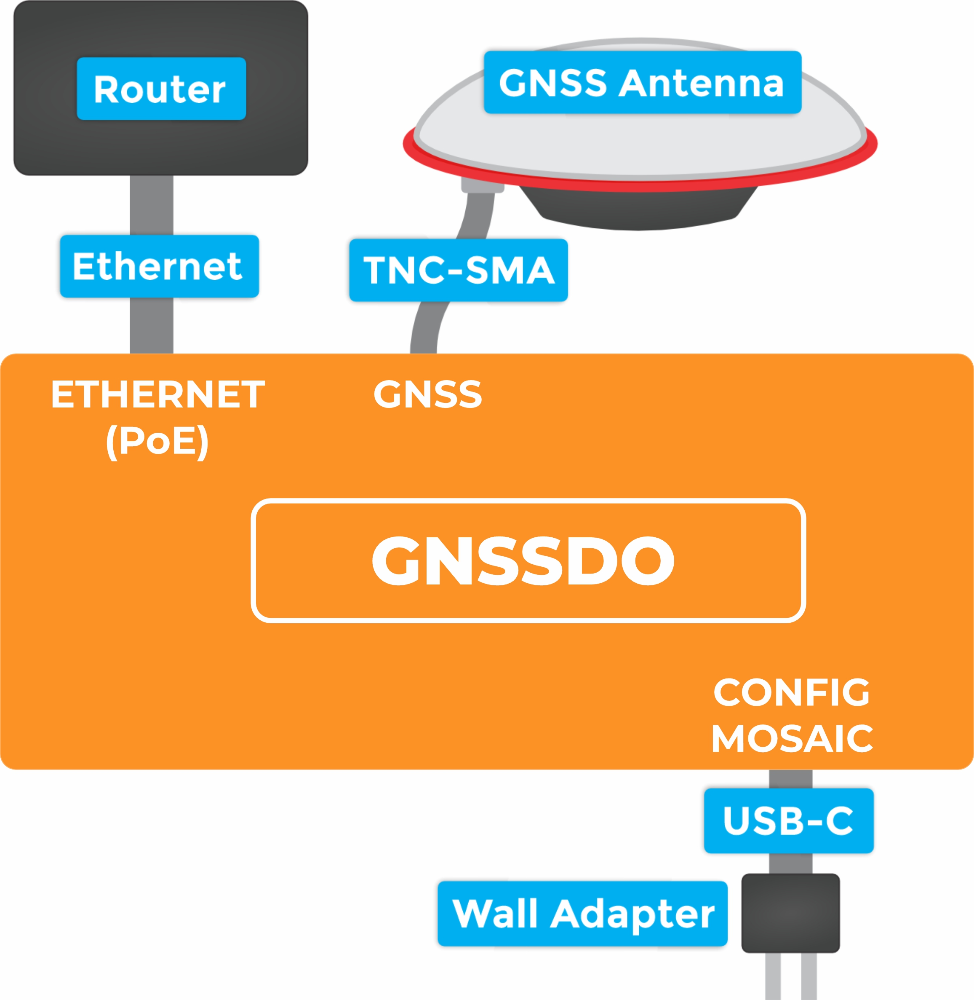
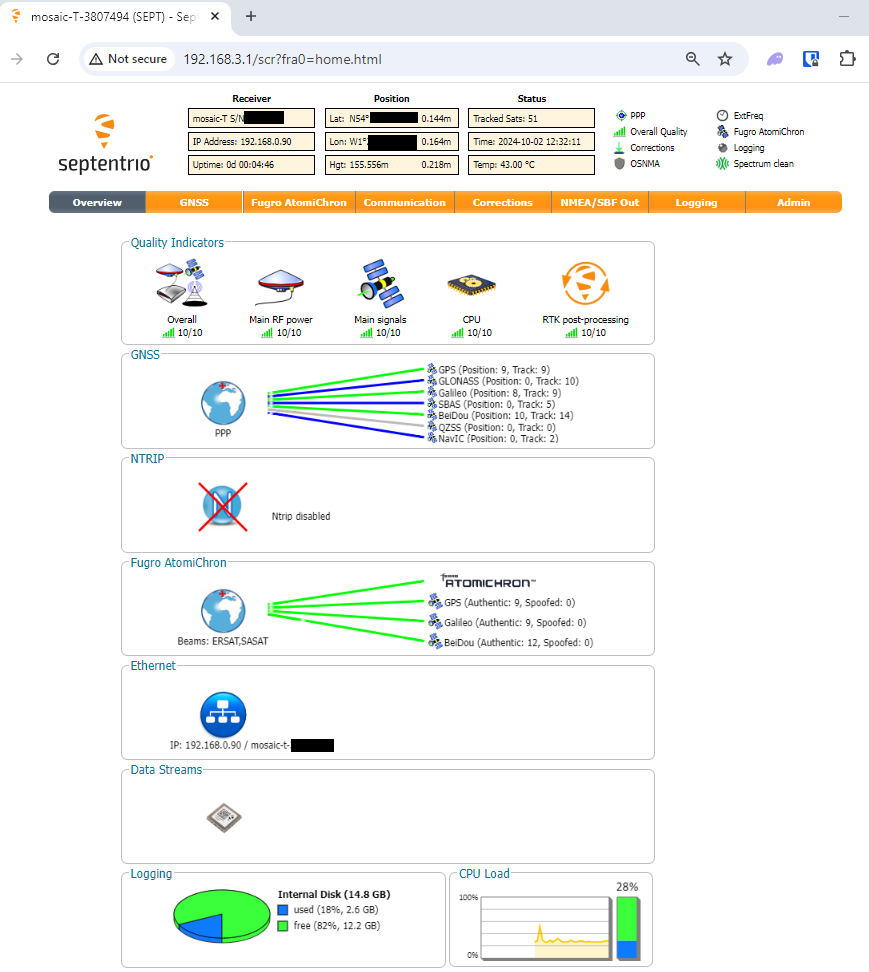
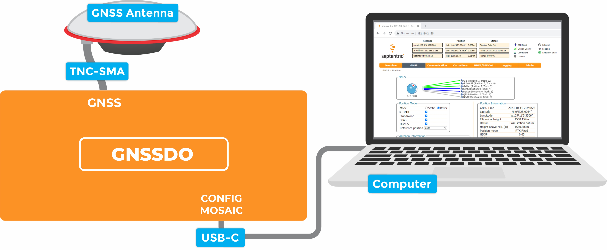
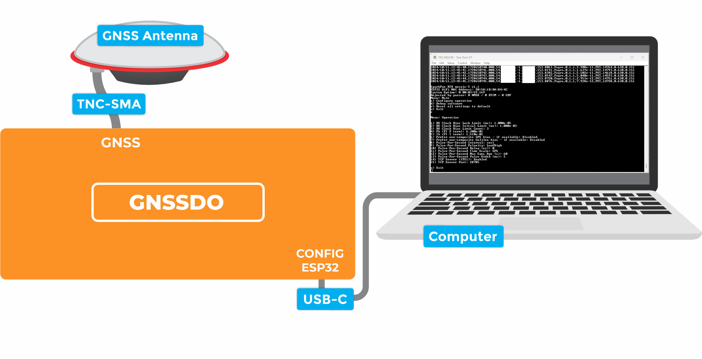

!!! abstract "Directions"

	This *quick start* guide is intended to help users get started with the SparkPNT GNSSDO, without having to review the technical details of this product. It includes the minimum instructions to initially set up the GNSSDO, depending on the primary interface that users would like to utilize:

	

	

	[**Ethernet**](./quick_start.md/#ethernet)

	: Instructions to connect the GNSSDO to a local network with an ethernet cable. This will provide the mosaic-T module with network connectivity for its internal web server; where, users can access its web pages with any computer or mobile device to configure the mosaic-T GNSS module.

	[**mosaic-T USB-C**](./quick_start.md/#mosaic-t-usb-c)

	: For users that just want to interface and configure the mosaic-T GNSS module, inside the GNSSDO, directly through a computer.

	[**ESP32 USB-C**](./quick_start.md/#esp32-usb-c)

	: For users that want to interface with the firmware running on the GNSSDO, using a terminal emulator on a computer.

	

	

	<figure markdown>
	
	<figcaption markdown>
	Click on the tab of your preferred interface (below), to get started with the GNSSDO.
	</figcaption>
	</figure>

	

	

	??? info ":material-printer: Quick Start Pamphlet"
		For users who have lost the pamphlet in their kit, please check out the links below to download the `*.pdf` file:

		<figure markdown>
		[{ width="150" }](./assets/img/qr_code/quick_start_guide.png "Click to enlarge")
		<figcaption markdown>
		[:octicons-download-16:{ .heart } Download the Quick Start Guide :fontawesome-solid-file-pdf:](./assets/quick_start_guide-v10.pdf "Click to Download"){ .md-button .md-button--primary }
		</figcaption>
		</figure>
		

		*Click on the button (above) or scan the QR code with a mobile device, to download the `*.pdf` file of the quick start pamphlet.*
		

=== "<H2>:material-ethernet: Ethernet</H2>"

	The simplest way to get your GNSSDO up and running is to connect it to your Ethernet network or an Ethernet port on your broadband router:

	<figure markdown>
	[{ width="300" }](./assets/img/hookup_guide/quickstart_setup-ethernet.jpg "Click to enlarge")
	<figcaption markdown>
	[Ethernet Connections (PNG)](./assets/img/hookup_guide/quickstart_setup-ethernet.jpg) for the GNSSDO.
	</figcaption>
	</figure>

	**`1`** - **Connect the GNSS antenna**
	: - Inside your SparkPNT GNSSDO kit, you will find the L1/L2/L5 GNSS "UFO" antenna. It has a TNC connection. Use the supplied TNC-SMA cable to connect the antenna to the `GNSS` SMA connection on the GNSSDO.
		- The antenna needs a clear view of the sky. If you are working indoors, put the antenna outside and pass the cable through a window. (Insulating double-glazed windows have a coating which can block the GNSS signal.)
		- Make sure the antenna is securely mounted to a structure so that it cannot be moved.
	**`2`** - **Connect the GNSSDO to your Ethernet network or router**
	: - Use the supplied CAT-6 Ethernet cable to connect the `ETHERNET (PoE)` port to your network or an Ethernet port on your router.
		- If your router provides Power-over-Ethernet (PoE), you're all set *(skip the next step)*!
			- You should see the red `PWR` LED light up and text start to appear on the OLED display.
		- If your router does not provide PoE, move on to step `3`.
	**`3`** - **Provide power**
	: - You can power the GNSSDO using the supplied USB power supply (wall adapter) and USB cable.
			- Plug the power supply into the wall.
			- Use the supplied USB-C cable to connect the power supply to either of the USB-C ports.
		- You should see the red power `PWR` LED light up and text appear on the OLED display.

	Once the mosaic-T has acquired a satellite signal and is connected to the Ethernet network, the OLED will display: the date and time; the antenna's position as Latitude (Lat) and Longitude (Long); the Ethernet IP (Internet Protocol) network address.

	Connect your computer or mobile device to the same network that the GNSSDO is on, open a web browser and navigate to the IP address shown on the OLED display. You should be able to access the mosaic-T module's internal web sever. Each web page displays a lot of helpful information and can also be used to fully configure the mosaic-T GNSS module.

	<figure markdown>
	[{ width="400" }](./assets/img/hookup_guide/T-web-page.png "Click to enlarge")
	<figcaption markdown>
	[mosaic-T web page (PNG)](./assets/img/hookup_guide/T-web-page.png) for the GNSSDO.
	</figcaption>
	</figure>

	!!! tip "Not working?"
		The following sections will help if your GNSSDO is not working as expected:

		??? info "No power?"
			The red power `PWR` LED will light up when the GNSSDO has power. If the `PWR` LED is off, make sure the wall adapter has power and the USB cable is connected.

			If you use your own Ethernet cable for Power-over-Ethernet, check it has all eight pins connected. Some cables only have four pins connected and do not support Power-over-Ethernet.

		??? info "No position information?"
			The OLED display will only show position information (Lat, Long etc.) once a satellite signal has been acquired. If you don't see these on the display, check the SMA to TNC cable is connected correctly and that the antenna is outside with a clear view of the sky. Use a [male-female SMA extension cable](https://www.sparkfun.com/interface-cable-sma-female-to-sma-male-10m-rg58.html) if needed to increase the cable length.

		??? info "No IP address?"
			Check the Ethernet interface is enabled. It may be disabled. Connect via the `CONFIG MOSAIC` USB-C port and open **`192.168.3.1`** on a web browser. Check the **Communication \ Ethernet** sub-page.

			

			<figure markdown>
			[{ width="150" }](./assets/img/hookup_guide/Ethernet-disabled.png "Click to enlarge")
			<figcaption markdown>
			[mosaic-T web page (PNG)](./assets/img/hookup_guide/Ethernet-disabled.png) with Ethernet disabled.
			</figcaption>
			</figure>

			<figure markdown>
			[{ width="150" }](./assets/img/hookup_guide/Ethernet-enabled.png "Click to enlarge")
			<figcaption markdown>
			[mosaic-T web page (PNG)](./assets/img/hookup_guide/Ethernet-enabled.png) with Ethernet enabled.
			</figcaption>
			</figure>

			

			By default, the mosaic-T Ethernet port is configured for Dynamic Host Configuration Protocol (DHCP). It expects the router / Ethernet switch to provide it with an IP address. If the IP address is all zeros (`0.0.0.0`), check that your router has DHCP enabled. Most do.

			If you need a static IP address, you can configure this through the mosaic-T's **Communication \ Ethernet** sub-page.

			Subnet 3 is reserved for the mosaic-T's USB-C connection (Ethernet-over-USB). If your router / switch is allocating addresses using subnet 3 (`192.168.3.***`), please change its settings so it uses a different subnet.

		??? info "No web page?"
			If you can not see the mosaic-T's internal web page, please check that your computer / tablet / phone is connected to the same network. Most broadband routers support both Ethernet and WiFi simultaneously using the same subnet. If you are using a phone, check it is connected to the router WiFi - and not using its mobile data connection.

			Subnet 3 is reserved for the mosaic-T's USB-C connection (Ethernet-over-USB). If your router / switch is allocating addresses using subnet 3 (`192.168.3.***`), please change its settings so it uses a different subnet. If it is using subnet 3, both the mosaic-T and your device will appear to have valid IP addresses but will not be able to communicate.

=== "<H2>:material-usb-port: mosaic-T USB-C</H2>"

	The mosaic-T has a built-in high-speed USB port which supports Ethernet-over-USB and two additional UART `COM` ports. To take advantage of this interface, you first need to install [Septentrio's USB driver](./software_overview.md/#septentrio-usb-driver).

	<figure markdown>
	[{ width="600" }](./assets/img/hookup_guide/quickstart_setup-mosaic.jpg "Click to enlarge")
	<figcaption markdown>
	[USB Connections (PNG)](./assets/img/hookup_guide/quickstart_setup-mosaic.jpg) for the GNSSDO.
	</figcaption>
	</figure>

	`1` - **Connect the GNSS antenna**
	: - Inside your SparkPNT GNSSDO kit, you will find the L1/L2/L5 GNSS "UFO" antenna. It has a TNC connection. Use the supplied TNC-SMA cable to connect the antenna to the `GNSS` SMA connection on the GNSSDO.
		- The antenna needs a clear view of the sky. If you are working indoors, put the antenna outside and pass the cable through a window. (Insulating double-glazed windows have a coating which can block the GNSS signal.)
		- Make sure the antenna is securely mounted to a structure so that it cannot be moved.
	`2` - **Download and install Septentrio RxTools**
	: - The [Septentrio mosaic-T Resources page](https://www.septentrio.com/en/products/gnss-receivers/gnss-receiver-modules/mosaic-t#resources) has download links for the mosaic-T datasheet, firmware, firmware guide, hardware manual, how-to videos and the **RxTools** support tool suite.
		- **RxTools** includes the USB driver for the mosaic-T module plus several tools, which you can use to control and configure the mosaic-T, forward data, log data, analyze the log files, convert the log files to other formats, and configure the module for use with other GIS software.
		- [Download and install **RxTools**.](./software_overview.md/#rxtools-software-suite)
	`3` - **Connect the GNSSDO to your computer**
	: - Use the supplied USB-C cable to connect the `CONFIG MOSAIC` port to your computer.

	<!-- Needed to break from list -->
	`4` - **Open the web page**
	: - Open a web browser on your computer and navigate to **`192.168.3.1`** to view the mosaic-T's internal web page.

	You can now use the RxTools suite to take full advantage of the sophisticated mosaic-T.

	!!! tip "Not working?"
		The following sections will help if your GNSSDO is not working as expected:

		??? info "No power?"
			The red power `PWR` LED will light up when the GNSSDO has power. If the `PWR` LED is off, make sure the USB cable is connected.

		??? info "No position information?"
			The OLED display will only show position information (Lat, Long, Alt etc.) once a satellite signal has been acquired. If you see only an IP address on the display, check the SMA to TNC cable is connected correctly and that the antenna is outside with a clear view of the sky. Use a [male-female SMA extension cable](https://www.sparkfun.com/interface-cable-sma-female-to-sma-male-10m-rg58.html) if needed to increase the cable length.

		??? info "No web page?"
			If you can not see the mosaic-T's internal web page at **`192.168.3.1`**, please check that your computer / tablet / phone is connected correctly to the USB-C port.

			Subnet 3 is reserved for the mosaic-T's USB-C connection (Ethernet-over-USB). If your computer is simultaneously connected to an Ethernet or WiFi network that also uses subnet 3 (`192.168.3.***`), please change the network settings so it uses a different subnet.

=== "<H2>:material-usb-port: ESP32 USB-C</H2>"

	The SparkPNT GNSSDO contains an ESP32-WROVER microcontroller module, which is able to discipline the frequency of the internal SiT5358 temperature-controlled crystal oscillator (TCXO). By linking the `CONFIG ESP32` USB-C port to your computer, you can view and modify the settings of the ESP32 firmware using a terminal emulator.

	<figure markdown>
	[{ width="600" }](./assets/img/hookup_guide/quickstart_setup-esp32.jpg "Click to enlarge")
	<figcaption markdown>
	[USB Connections (JPG)](./assets/img/hookup_guide/quickstart_setup-esp32.jpg) for the GNSSDO.
	</figcaption>
	</figure>

	`1` - **Connect the GNSS antenna**
	: - Inside your SparkPNT GNSSDO kit, you will find the L1/L2/L5 GNSS "UFO" antenna. It has a TNC connection. Use the supplied TNC-SMA cable to connect the antenna to the `GNSS` SMA connection on the GNSSDO.
		- The antenna needs a clear view of the sky. If you are working indoors, put the antenna outside and pass the cable through a window. (Insulating double-glazed windows have a coating which can block the GNSS signal.)
		- Make sure the antenna is securely mounted to a structure so that it cannot be moved.
	`2` - **Download and install a terminal emulator like Tera Term**
	: - To communicate with the firmware running on the ESP32, you will need a serial console or terminal emulator.
			- If you are using Windows, we still recommend [Tera Term](https://learn.sparkfun.com/tutorials/112)
	`3` - **Connect the GNSSDO to your computer**
	: - Use the supplied USB-C cable to connect the `CONFIG ESP32` port to your computer.
			- You may need to [install a USB driver](./software_overview.md/#ch340-usb-driver) first, so that the CH340 serial interface chip is recognized.
	`4` - **Open the terminal emulator**
	: - Open the terminal emulator and connect to the CH340 COM port. Select **115200bps** as the baud rate.
		- Once connected, you will see a debug message from the ESP32 every second. The message contains the date, time, Lat, Long and other information about the clock accuracy.
		- Pressing any key will open the [configuration menu](./software_overview.md/#software-settings), allowing you to change the firmware settings if needed.
			- The firmware settings are stored in flash (non-volatile) memory when you exit the menus. After changing them, exit the menus completely, then you can disconnect the computer and power the GNSS using the supplied wall charger.

		!!! note
			You should never need to change most of the firmware settings, the default settings will meet the needs of almost all users.

		!!! tip
			Enabling the [**TCP Server (IPS1)**](./software_overview.md/#tcp-server-ips1) option via the Configure Operation menu will allow you to access the firmware serial console via TCP. The firmware settings can then be accessed over the Ethernet or Ethernet-over-USB interfaces, instead of CONFIG ESP32 USB-C. The TCP port number can be changed via the menu; the default TCP port is **28785**.

	!!! tip "Not working?"
		The following sections will help if your GNSSDO is not working as expected:

		??? info "No power?"
			The red power `PWR` LED will light up when the GNSSDO has power. If the `PWR` LED is off, make sure the USB cable is connected.

		??? info "No position information?"
			The OLED display will only show position information (Lat, Long, Alt etc.) once a satellite signal has been acquired. If you see only an IP address on the display, check the SMA to TNC cable is connected correctly and that the antenna is outside with a clear view of the sky. Use a [male-female SMA extension cable](https://www.sparkfun.com/interface-cable-sma-female-to-sma-male-10m-rg58.html) if needed to increase the cable length.

		??? info "No serial console?"
			If you can not see the debug messages and configuration menu in the terminal emulator, check that: you have [installed the CH340 driver](https://learn.sparkfun.com/tutorials/908) if needed; you are connected to the CH340 COM port; you have selected **115200bps** as the baud rate.
