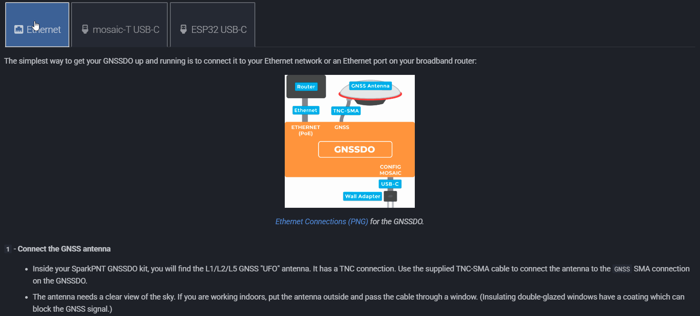
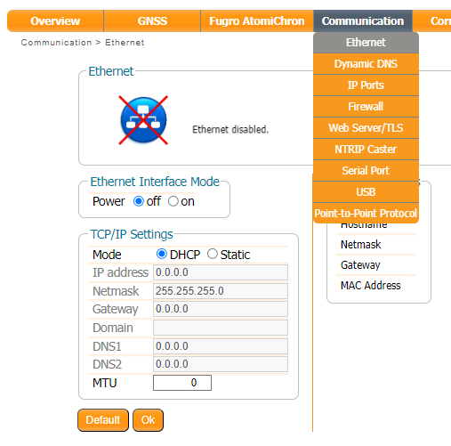
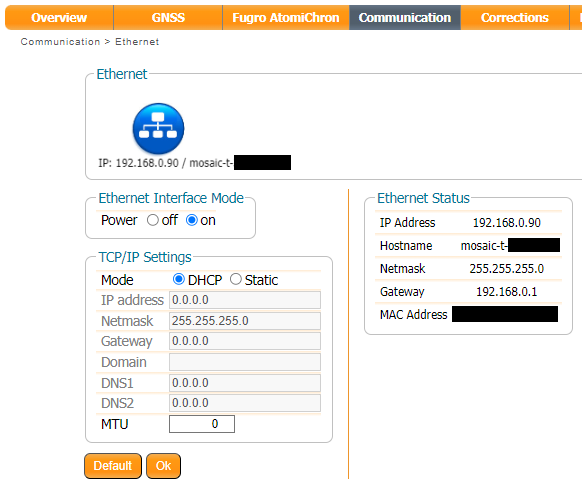
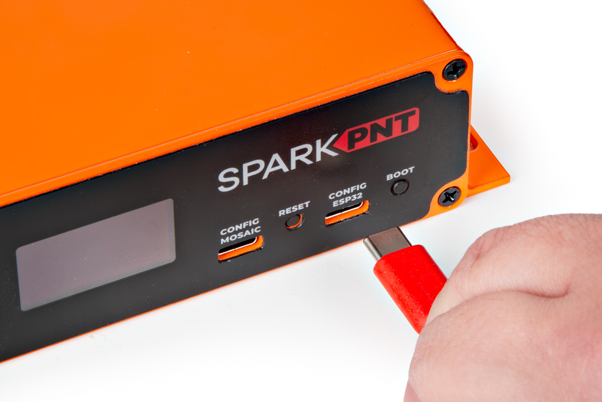

!!! abstract "Directions"

	This *quick start* guide is intended to help users get started with their RTK mosaic-T, without having to review the technical details of the product. It includes the minimum instructions to initially set up the RTK mosaic-T, depending on the primary interface that users would like to utilize:

	

	

	**Ethernet**

	: Instructions to connect the RTK mosaic-T to a network with an ethernet cable. This will provide the mosaic-T with network connectivity for its web server. Users can then pull up the configuration web page from any computer connected to that network.

	**mosaic-T USB-C**

	: For users that just want to interface and set up the RTK mosaic-T, directly through their computer.

	**ESP32 USB-C**

	: For users that want to configure the RTK mosaic-T firmware, using a terminal emulator on  their computer.

	

	

	<figure markdown>
	
	<figcaption markdown>
	Click on the tab of your preferred interface (below), to get started with the RTK mosaic-T.
	</figcaption>
	</figure>

	

	

	??? info ":material-printer: Quick Start Pamphlet"
		For users who have lost the pamphlet in their kit, please check out the links below to download the `*.pdf` file:

		<figure markdown>
		[{ width="150" }](./assets/img/qr_code/quick_start_guide.png "Click to enlarge")
		<figcaption markdown>
		[:octicons-download-16:{ .heart } Download the Quick Start Guide :fontawesome-solid-file-pdf:](./assets/quick_start_guide-v10.pdf "Click to Download"){ .md-button .md-button--primary }
		</figcaption>
		</figure>
		

		*Click on the button (above) or scan the QR code with a mobile device, to download the `*.pdf` file of the quick start pamphlet.*
		

=== "<H2>:material-ethernet:&nbsp;Ethernet</H2>"

	The simplest way to get your RTK mosaic-T up and running is to connect it to your Ethernet network or an Ethernet port on your broadband router:

	<figure markdown>
	[{ width="400" }](./assets/img/hookup_guide/Ethernet_Connections.png "Click to enlarge")
	<figcaption markdown>
	[Ethernet Connections (PNG)](./assets/img/hookup_guide/Ethernet_Connections.png) for the RTK mosaic-T.
	</figcaption>
	</figure>

	**`1`** - **Connect the GNSS antenna**
	: * Inside your RTK mosaic-T kit, you will find the L1/L2/L5 GNSS "UFO" antenna. It has a TNC connection. Use the supplied TNC-SMA cable to connect the antenna to the mosaic-T **GNSS** SMA connection.
		* The antenna needs a clear view of the sky. If you are working indoors, put the antenna outside and pass the cable through a window. (Insulating double-glazed windows have a coating which can block the GNSS signal. For best results, put the antenna outside.)
	**`2`** - **Connect the RTK mosaic-T to your Ethernet network or router**
	: * Use the supplied CAT-6 Ethernet cable to connect the **ETHERNET (PoE)** port to your network or an Ethernet port on your router.
		* If your router provides Power-over-Ethernet (PoE), you're all set! You should see the red power (PWR) LED light up and text start to scroll up the OLED display.
		* If your router does not provide PoE, move on to step 3.
	**`3`** - **Provide power**
	: * You can power the RTK mosaic-T using the supplied USB power supply (5V 1A wall adapter).
		* Plug the power supply into the wall.
		* Use the supplied USB-C cable to connect the power supply to either the **CONFIG MOSAIC** or the **CONFIG ESP32** USB-C port. It does not matter which.
		* You should see the red power (PWR) LED light up and text start to scroll up the OLED display.

	Once the mosaic-T has acquired a satellite signal and is connected to the Ethernet network, the OLED will display: the date and time; the antenna's position as Latitude (Lat) and Longitude (Long); the Ethernet IP (Internet Protocol) network address.

	Connect your computer, tablet or phone to the same network, open a web browser and navigate to the IP address shown on the OLED display. You should see the mosaic-T's internal web page. The web page displays a lot of helpful information and can also be used to fully configure the mosaic-T.

	<figure markdown>
	[{ width="400" }](./assets/img/hookup_guide/T-web-page.png "Click to enlarge")
	<figcaption markdown>
	[mosaic T web page (PNG)](./assets/img/hookup_guide/T-web-page.png) for the RTK mosaic-T.
	</figcaption>
	</figure>

	!!! tip "Not working?"
		The following sections will help if your RTK mosaic-T is not working as expected:

		??? info "No power?"
			The red power (PWR) LED will light up when the RTK mosaic-T has power. If the PWR LED is off, make sure the wall adapter has power and the USB cable is connected.

			If you use your own Ethernet cable for Power-over-Ethernet, check it has all eight pins connected. Some cables only have four pins connected and do not support Power-over-Ethernet.

		??? info "No position information?"
			The OLED display will only show position information (Lat, Long etc.) once a satellite signal has been acquired. If you don't see these on the display, check the SMA to TNC cable is connected correctly and that the antenna is outside with a clear view of the sky. Use a [male-female SMA extension cable](https://www.sparkfun.com/products/21281) if needed to increase the cable length.

		??? info "No IP address?"
			Check the Ethernet interface is enabled. It may be disabled. Connect via the CONFIG MOSAIC USB-C port and open 192.168.3.1 on a web browser. Check the **Communication \ Ethernet** sub-page.

			

			<figure markdown>
			[{ width="150" }](./assets/img/hookup_guide/Ethernet-disabled.png "Click to enlarge")
			<figcaption markdown>
			[mosaic-T web page (PNG)](./assets/img/hookup_guide/Ethernet-disabled.png) with Ethernet disabled.
			</figcaption>
			</figure>

			<figure markdown>
			[{ width="150" }](./assets/img/hookup_guide/Ethernet-enabled.png "Click to enlarge")
			<figcaption markdown>
			[mosaic-T web page (PNG)](./assets/img/hookup_guide/Ethernet-enabled.png) with Ethernet enabled.
			</figcaption>
			</figure>

			

			By default, the mosaic-T Ethernet port is configured for Dynamic Host Configuration Protocol (DHCP). It expects the router / Ethernet switch to provide it with an IP address. If the IP address is all zeros (0.0.0.0), check that your router has DHCP enabled. Most do.

			If you need a static IP address, you can configure this through the mosaic-T's **Communication \ Ethernet** sub-page.

			Subnet 3 is reserved for the mosaic-T's USB-C connection (Ethernet-over-USB). If your router / switch is allocating addresses using subnet 3 (192.168.3.***), please change its settings so it uses a different subnet.

		??? info "No web page?"
			If you can not see the mosaic-T's internal web page, please check that your computer / tablet / phone is connected to the same network. Most broadband routers support both Ethernet and WiFi simultaneously using the same subnet. If you are using a phone, check it is connected to the router WiFi - and not using its mobile data connection.

			Subnet 3 is reserved for the mosaic-T's USB-C connection (Ethernet-over-USB). If your router / switch is allocating addresses using subnet 3 (192.168.3.***), please change its settings so it uses a different subnet. If it is using subnet 3, both the mosaic-T and your device will appear to have valid IP addresses but will not be able to communicate.

=== "<H2>:material-usb-port:&nbsp;mosaic-T USB-C</H2>"

	The mosaic-T has a built-in high-speed USB port which supports Ethernet-over-USB. To take advantage of this interface, you first need to install the Septentrio drivers.

	<figure markdown>
	[{ width="400" }](./assets/img/hookup_guide/USB_Connections.png "Click to enlarge")
	<figcaption markdown>
	[USB Connections (PNG)](./assets/img/hookup_guide/USB_Connections.png) for the RTK mosaic-T.
	</figcaption>
	</figure>

	`1` - **Connect the GNSS antenna**
	: * Inside your RTK mosaic-T kit, you will find the L1/L2/L5 GNSS "UFO" antenna. It has a TNC connection. Use the supplied TNC-SMA cable to connect the antenna to the mosaic-T **GNSS** SMA connection.
		* The antenna needs a clear view of the sky. If you are working indoors, put the antenna outside and pass the cable through a window. (Insulating double-glazed windows have a coating which can block the GNSS signal. For best results, put the antenna outside.)
	`2` - **Download and install Septentrio RxTools**
	: * The [Septentrio mosaic-T Resources page](https://www.septentrio.com/en/products/gnss-receivers/gnss-receiver-modules/mosaic-t#resources) has download links for the mosaic-T datasheet, firmware, firmware guide, hardware manual, how-to videos and the **RxTools** support tool suite.
		* **RxTools** includes the driver for the USB-C port plus several tools, which you can use to control and configure the mosaic-T, forward data, log data, analyze the log files, convert the log files to other formats, and configure the module for use with other GIS software.
		* Download and install **RxTools**.
	`3` - **Connect the RTK mosaic-T to your computer**
	: * Use the supplied USB-C cable to connect the **CONFIG MOSAIC** port to your computer.

	<!-- Needed to break from list -->
	`4` - **Open the web page**
	: * Open a web browser on your computer and navigate to **192.168.3.1** to view the mosaic-T's internal web page.

	You can now use the RxTools suite to take full advantage of the sophisticated mosaic-T.

	!!! tip "Not working?"
		The following sections will help if your RTK mosaic-T is not working as expected:

		??? info "No power?"
			The red power (PWR) LED will light up when the RTK mosaic-T has power. If the PWR LED is off, make sure the USB cable is connected.

		??? info "No position information?"
			The OLED display will only show position information (Lat, Long, Alt etc.) once a satellite signal has been acquired. If you see only an IP address on the display, check the SMA to TNC cable is connected correctly and that the antenna is outside with a clear view of the sky. Use a [male-female SMA extension cable](https://www.sparkfun.com/products/21281) if needed to increase the cable length.

		??? info "No web page?"
			If you can not see the mosaic-T's internal web page at **192.168.3.1**, please check that your computer / tablet / phone is connected correctly to the USB-C port.

			Subnet 3 is reserved for the mosaic-T's USB-C connection (Ethernet-over-USB). If your computer is simultaneously connected to an Ethernet or WiFi network that also uses subnet 3 (192.168.3.***), please change the network settings so it uses a different subnet.

=== "<H2>:material-usb-port:&nbsp;ESP32 USB-C</H2>"

	The SparkFun RTK mosaic-T contains an ESP32-WROVER microcontroller module. You can connect to its console through the **CONFIG ESP32** USB-C connector.

	<figure markdown>
	[{ width="400" }](./assets/img/hookup_guide/assembly-usb-esp32.jpg "Click to enlarge")
	<figcaption markdown>
	[USB Connections (JPG)](./assets/img/hookup_guide/assembly-usb-esp32.jpg) for the RTK mosaic-T.
	</figcaption>
	</figure>

	`1` - **Connect the GNSS antenna**
	: * Inside your RTK mosaic-T kit, you will find the L1/L2/L5 GNSS "UFO" antenna. It has a TNC connection. Use the supplied TNC-SMA cable to connect the antenna to the mosaic-T **GNSS** SMA connection.
		* The antenna needs a clear view of the sky. If you are working indoors, put the antenna outside and pass the cable through a window. (Insulating double-glazed windows have a coating which can block the GNSS signal. For best results, put the antenna outside.)
	`2` - **Download and install a terminal emulator like Tera Term**
	: * To communicate with the firmware running on the ESP32, you will need a serial console or terminal emulator.
		* If you are using Windows, we still recommend [Tera Term](https://learn.sparkfun.com/tutorials/112)
	`3` - **Connect the RTK mosaic-T to your computer**
	: * Use the supplied USB-C cable to connect the **CONFIG ESP32** port to your computer.

	<!-- Needed to break from list -->
	`4` - **Open the terminal emulator**
	: * Open the terminal emulator and connect to the CH340 COM port. Select **115200** as the baud rate.
		* Once connected, you will see a debug message from the ESP32 every second. The message contains the date, time, Lat, Long and other information about the clock accuracy.
		* Pressing any key will open the [configuration menu](./software_overview.md), allowing you to change the firmware settings if needed.

	!!! tip "Not working?"
		The following sections will help if your RTK mosaic-T is not working as expected:

		??? info "No power?"
			The red power (PWR) LED will light up when the RTK mosaic-T has power. If the PWR LED is off, make sure the USB cable is connected.

		??? info "No position information?"
			The OLED display will only show position information (Lat, Long, Alt etc.) once a satellite signal has been acquired. If you see only an IP address on the display, check the SMA to TNC cable is connected correctly and that the antenna is outside with a clear view of the sky. Use a [male-female SMA extension cable](https://www.sparkfun.com/products/21281) if needed to increase the cable length.

		??? info "No serial console?"
			If you can not see the debug messages and configuration menu in the terminal emulator, check that: you have [installed the CH340 driver](https://learn.sparkfun.com/tutorials/908) if needed; you are connected to the CH340 COM port; you have selected 115200 as the baud rate.
