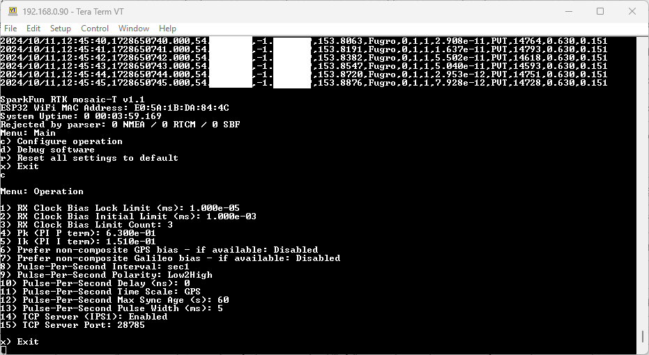
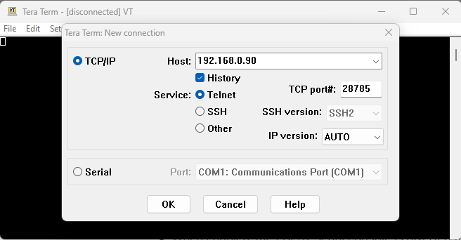

!!! code "ESP32 Firmware"
	We have intentionally kept the ESP32 firmware as simple as possible - its only tasks are to: discipline the TCXO oscillator; control the OLED display. The intention is that you can easily develop your own firmware for the GNSSDO if the SparkFun firmware does not meet your needs.

	The **[/Firmware/Binaries](https://github.com/sparkfun/SparkFun_GNSSDO/tree/main/Firmware/Binaries)** folder contains the firmware binaries.
	
	You can update or reload the firmware using the [SparkFun RTK Firmware Uploader](https://github.com/sparkfun/SparkFun_RTK_Firmware_Uploader).

	You can of course modify the hardware too, should you want to. The design is completely open-source.

!!! note
	The mosaic-T module has numerous capabilities and a multitude of ways to configure and interface with them. Without regurgitating all the information that is documented in Septentrio's user manuals and videos, we have tried to highlight a good majority of the module's aspects.

	With that said, please feel free to [file an issue](../github/file_issue/#discrepancies-in-the-documentation) if you feel we have missed something that may benefit other users. *(Don't forget to provide us with a link to the documentation and what section the information is located.)*


## :septentrio-logo:&nbsp;mosaic-T

### RxTools Software Suite

!!! tip
	Even if you aren't necessarily interested in it, we highly recommend that users install the [RXTools software suite](https://www.septentrio.com/en/products/gps-gnss-receiver-software/rxtools) before plugging in their board. For Windows PCs, it also includes the USB driver for the module that enables the Ethernet-over-USB support and virtual `COM` ports.

Users should install the [RXTools software suite](https://www.septentrio.com/en/products/gps-gnss-receiver-software/rxtools) on their computer to interact with the mosaic-T module through the USB interface. The software package includes the USB-IP driver[^1] necessary to recognize the board as an ethernet device on Windows PCs (1).
{ .annotate }

1. On Linux, the standard Linux CDC-ACM driver is suitable.

[^1]: On Linux, the standard Linux CDC-ACM driver is suitable.


<center>
[:octicons-download-16:{ .heart } Download the RxTools Software from Septentrio](https://www.septentrio.com/en/products/gps-gnss-receiver-software/rxtools){ .md-button .md-button--primary target="blank" }
</center>

??? info "System Requirements[^2]"

	=== "Operating Systems"

		* Windows 7
		* Windows 8
		* Windows 10
		* Fedora 23 *(or later)* using Qt technology.
			* The standalone tools (except `bin2asc`) will run on older distributions.

	=== "Hardware Requirements"
		The minimal hardware requirements *(1Hz update[^3])*:

		* CPU: 1 GHz processor
		* RAM: 1 GB RAM
		* Screen Resolution: 1024×768 or higher resolution

	[^2]: The system requirements and installation instructions are from the RxTools *v22.1.0* user manual. This information may change in later iterations of the software suite. Please refer to the user manual *(of the version you are utilizing)* for the most accurate information.
	[^3]: Higher data rates will require higher CPU speed and more memory capacity.


??? info "Installation Instructions[^2]"

	=== "Windows"
		Users can install RxTools software suite by running the installation executable[^4](1), located in the `RxTools\windows` directory of the downloaded `*.zip` file[^5]. During the installation process, users will be notified if a previous version of RxTools is already installed then the previous version will be uninstalled. Next, users will need to provide an installation directory for the RxTools software suite. Users will then select which of the following applications[^6] are installed:
		{ .annotate }

		1. For RxTools v22.1.0, the installation filename is `RxTools_22_1_0_Installer.exe` for Windows PCs.

		<!-- Create Break from Annotation (list won't render without comment)-->

		<div class="grid" markdown>

		<div markdown>

		* RxControl
		* SBF Converter
		* SBF Analyzer
		* RxLogger

		</div>

		<div markdown>

		* RxUpgrade
		* RxDownload
		* RxPlanner

		</div>

		<div markdown>

		* Data Link
		* RxAssistant
		* RxLauncher

		</div>

		</div>


	=== "Linux[^1]"
		!!! warning
			It is recommended that users **<span style="color:red">NOT</span>** install RxControl as `root`, for security reasons and to avoid installation overwrites of other system settings. To make RxTools available to more than one user, provide a shared installation directory.

		Users can install RxTools software suite by running the installation binary[^4](1), located in the `RxTools/linux-i386/` directory of the downloaded `*.zip` file[^5]. During the installation, users will be prompted for an installation directory. If there are any previous installations of RxControl, please use a different directory to avoid conflicts.
		{ .annotate }

		1. For RxTools v22.1.0, the installation filename is `RxTools_22_1_0_Installer.bin` for Linux.

		??? info "Permission Settings"
			Once installed, users may need to reconfigure their permission settings:

			<div class="annotate" markdown>

			* RxTools will need rights to access the `/dev/ttyS*` serial ports.

				* To access the serial ports, users must be part of the `uucp` and `lock` groups (1). This can be configured by editing the `/etc/group`[^7] file and adding the username to the lines defining the `uucp` group and the `lock` group.

					For example, when adding the user `jsmith` to the `uucp` group, users would modify the `/etc/group` file as shown below:

					```bash
					{--uucp:x:14:uucp--} # (2)!
					{++uucp:x:14:uucp,jsmith++} # (3)!
					```

				* On Linux machine administered centrally on a local network, ask your system administrator to be included in the `uucp` and `lock` groups.
			* RxTools also needs read/write (`rw`) access(4) to the `/dev/ttyS*` serial ports.

				* Users can change the permissions with the `chmod`[^8] command:

					```bash
					chmod 660 /dev/ttyS<add port> # (5)!>
					```

			</div>

			1. On most Linux operating systems, the `/dev/ttyS*` devices are owned by `root` and belong to the `uucp` group with read/write (`rw`) access. Additionally, the devices are normally locked by writing a file in the `/var/lock/` directory, with the same permissions.
			2. Remove
			3. Replace with this line
			4. By default, users will normally have read/write (`rw`) access to the `/dev/ttyS*` serial ports.
			5. where users must specify the port number<br>*e.g. `/dev/ttyS0` might be port `COM1`*

			!!! note
				In order for these changes to take effect, users must update their environment by logging out and back in.

				Be aware that the X-session has to be restarted as well. On most systems, this can be done by pressing the key combination ++ctrl++ + ++alt++ + ++backspace++

		??? info "64-bit OS"
			In order to run the RxTools on a 64-bit Linux operating system, users might have to install the 32-bit version of the `C` standard library.

			* For Fedora installations, this is the `glibc.i686` package.
			* The equivalent for Debian(/Ubuntu) installations is the `ia32-libs` package.

	[^4]: Users will need administrative privileges to install the RxTools software.
	[^5]: Users may need to extract the RxTools installation files from the downloaded, compressed file.
	[^6]: Please see the release notes for the issues and limitations of the RxTools applications.
	[^7]: Requires c privileges.
	[^8]: Changing these permissions also requires `root` privileges.


### USB Driver
=== "Windows"
	If users haven't already installed the [RxTools software suite](https://www.septentrio.com/en/products/gps-gnss-receiver-software/rxtools) on their Windows PC, they will need to install the USB driver[^1] necessary to recognize and interact with the mosaic-T module through the USB interface.

	A Windows USB driver for the mosaic-T can be installed through two methods:

	<div class="annotate" markdown>

	* RxTools Software Suite (1)
	* mosaic-T GNSS Receiver Module (2)

	</div>

	1. The driver is installed during the installation process.
	2. The installation file for the Windows USB driver will be available from the mass-storage device when the board is initially connected to the computer.

	Once installed, the driver emulates two virtual serial ports, which can be accessed as standard `COM` ports to the receiver.

	??? tip "Terminal Emulators"
		Most [terminal emulation programs](https://learn.sparkfun.com/tutorials/112) will not make a distinction between virtual or native COM ports. However, for virtual serial ports, the port settings *(i.e. baud rate, etc.)* are not relevant and the default configuration is used in the terminal emulation program. However, the physical/native `COM` ports will have the following default setting: 

		* Baudrate: 115200bps
		* Data Bits: 8
		* Parity: No
		* Stop Bits: 1
		* Flow Control: None

	??? tip "Having Trouble?"
		For users who are having trouble installing the USB driver, we have an archived version *(v3.0.2[^9])* of the installation file. Users can download [**version 3.0.2**](https://docs.sparkfun.com/SparkFun_GNSS_mosaic-T/assets/component_documentation/driver/USB_driver_3_0_2_Installer.exe) of the driver, by clicking on the button below.

		[^9]:
			For the latest USB driver from Septentrio, please install their driver through the [RxTools software suite](../rxtools).<br>
			*This driver version was archived at the time that the [mosaic-T hookup guide](https://docs.sparkfun.com/SparkFun_GNSS_mosaic-T/) was written. Please do not request for the file to be updated.*

		<center>
		[:octicons-download-16:{ .heart } Download USB Driver *(v3.0.2)*](https://docs.sparkfun.com/SparkFun_GNSS_mosaic-T/assets/component_documentation/driver/USB_driver_3_0_2_Installer.exe){ .md-button .md-button--primary target="blank" }
		</center>


=== "Linux"
	On Linux, the standard Linux CDC-ACM driver is suitable for the mosaic-T module.


### Web Interface
With the USB driver installed, the mosaic-T module supports Ethernet-over-USB. The default IP address allocated for the Ethernet-over-USB interface is `192.168.3.1`. This IP can be entered in any browser to open a connection to the receiver's Web Interface as shown below.

<div class="grid" markdown>

<div markdown>

<figure markdown>
[{ width="600" }](./assets/img/hookup_guide/navigation_tabs.png "Click to enlarge")
<figcaption markdown>All the drop-down navigation tabs in the web interface.</figcaption>
</figure>

</div>

<div markdown>

<center>
<article class="video-500px">
<iframe src="https://www.youtube.com/embed/hrL5J6Q5gX8" title="Septentrio: Getting started with the Septentrio mosaic receiver module" frameborder="0" allow="accelerometer; autoplay; clipboard-write; encrypted-media; gyroscope; picture-in-picture" allowfullscreen></iframe>
</article>
</center>

</div>

</div>


!!! info
	The default IP address cannot be changed; this feature is only to be used when a single receiver is connected to your computer.

??? failure "Invalid IP Address *(WiFi Only)*"
	[One of the documentation pages on Septentrio's website](https://customersupport.septentrio.com/s/article/What-is-the-default-IP-address-to-connect-via-WiFi), specifies a default IP address of `192.168.20.1` for the web interface. However, that address is for a WiFi enabled product and cannot be used with this product.

## :espressif-logo:&nbsp;ESP32

### USB Driver
Users will need to install a USB driver for the CH340 serial-to-USB chip, in order to communicate with the ESP32 module.	The latest USB drivers for the CH340 are available from the manufacturer, on the [WCH website](https://www.wch-ic.com/products/CH340.html?):

<center>
[:octicons-download-16:{ .heart } Download the latest CH340 USB driver from WCH](https://www.wch-ic.com/products/CH340.html?){ .md-button .md-button--primary target="blank" }
</center>

??? abstract "Need Directions?"
	For users having trouble installing the CH340 USB driver, check out our video and hookup guide:

	<div class="grid" markdown align="center">

	<div markdown>

	<div class="video-500px">
	<iframe src="https://www.youtube.com/embed/MM9Fj6bwHLk" title="Tutorial: Installing CH340 Drivers" frameborder="0" allow="accelerometer; autoplay; clipboard-write; encrypted-media; gyroscope; picture-in-picture" allowfullscreen></iframe>
	</div>

	</div>

	<div class="grid cards" markdown>

	-   <a href="https://learn.sparkfun.com/tutorials/908">
		<figure markdown>
		
		</figure>

		---

		**How to Install CH340 Drivers**</a>

	</div>

	</div>


### Terminal Emulator
In order to configure the firmware settings on the ESP32, users will need to install a [serial terminal emulator](https://learn.sparkfun.com/tutorials/terminal-basics) on their computer.

=== "Windows"
	For Windows computers, we highly recommend [TeraTerm](https://teratermproject.github.io/index-en.html).

=== "Linux"
	Some Linux operating systems will already have the `screen` terminal emulator preinstalled.

!!! abstract "Need Directions?"
	Check out our hookup guide to install your favorite terminal emulator:

	<div class="grid cards" markdown align="center">

	-   <a href="https://learn.sparkfun.com/tutorials/112">
		<figure markdown>
		
		</figure>

		---

		**Serial Terminal Basics**</a>

	</div>

## :fontawesome-solid-screwdriver-wrench:&nbsp;Software Settings

When connected to the ESP32 CH340 COM port at 115200 baud, pressing any key in the terminal emulator will open the firmware Main Menu:

<figure markdown>
[{ width="600" }](./assets/img/hookup_guide/Main-Menu.png "Click to enlarge")
<figcaption markdown>The ESP32 firmware main menu.</figcaption>
</figure>

### Configure Operation

Select option **c** ("c" followed by "Enter") to configure the firmware:

<figure markdown>
[{ width="600" }](./assets/img/hookup_guide/Menu-Config.png "Click to enlarge")
<figcaption markdown>The ESP32 firmware configuration menu.</figcaption>
</figure>

* **1) RX Clock Bias Lock Limit**
	* This allows the clock bias limit to be set. The units are milliseconds.
	* The **LOCK** LED will illuminate when the bias is below this limit.
	* PPS output will begin when the bias has been below this limit for **RX Clock Bias Limit Count** seconds.
* **2) RX Clock Bias Initial Limit**
	* This allows the initial clock bias limit to be set. The units are milliseconds.
	* The firmware will soft-reset the GNSS if the clock bias is above this limit for **RX Clock Bias Limit Count** seconds.
	* This allows the firmware to restart the GNSS and re-sync the TCXO if the initial bias is excessive.
* **3) RX Clock Bias Limit Count**
	* This defines how many consecutive 1Hz samples are needed to trigger the two clock bias limits.
* **4) Pk (PI P term)**
	* This defines the Proportional term for the TCXO frequency PI control loop. Default is 0.63
	* This value was determined using approximate Ziegler-Nichols tuning of the SiT5358 loop.
* **5) Ik (PI I term)**
	* This defines the Integral term for the TCXO frequency PI control loop. Default is 0.151
	* This value was determined using approximate Ziegler-Nichols tuning of the SiT5358 loop.
* **6) Prefer non-composite GPS bias**
	* With a subscription to Fugro AtomiChron, this option allows the individual GPS clock bias to be preferred over the composite Fugro bias.
	* You can enable a preference for either GPS or Galileo. Enabling GPS will disable Galileo.
* **7) Prefer non-composite Galileo bias**
	* With a subscription to Fugro AtomiChron, this option allows the individual Galileo clock bias to be preferred over the composite Fugro bias.
	* You can enable a preference for either GPS or Galileo. Enabling Galileo will disable GPS.
* **8) Pulse-Per-Second Interval**
	* This defines the interval of the PPS signal. The intervals are defined by the mosiac-T firmware. Use "8" and "Enter" to scroll through the intervals.
	* "off"
    * "msec10"
    * "msec20"
    * "msec50"
    * "msec100"
    * "msec200"
    * "msec250"
    * "msec500"
    * "sec1"
    * "sec2"
    * "sec4"
    * "sec5"
    * "sec10"
    * "sec30"
    * "sec60"
* **9) Pulse-Per-Second Polarity**
	* This defines the PPS signal polarity: Low2High or High2Low
* **10) Pulse-Per-Second Delay**
	* This allows the timing of the PPS signal to be advanced or retarded. The units are nanoseconds.
* **11) Pulse-Per-Second Time Scale**
	* This defines which time scale is used to generate the PPS signal.
	* "GPS"
    * "Galileo"
    * "BeiDou"
    * "GLONASS"
    * "UTC"
    * "RxClock"
* **12) Pulse-Per-Second Max Sync Age**
	* This defines how long PPS pulses will be produced when the GNSS signal is lost or jammed: 0 to 3600 seconds.
* **13) Pulse-Per-Second Pulse Width**
	* This defines the width of the PPS signal. The units are milliseconds: 0.000001 to 1000.000000.
* **14) TCP Server (IPS1)**
	* See [TCP Server (IPS1)](#tcp-server-ips1) below for more details
* **15) TCP Server Port**
	* The port for the TCP connection. Default is 28785.

To reset all settings to their default values, select "r", "Enter", "y", "Enter"

The settings are saved to non-volatile memory (NVM, LittleFS) on exiting the menu. Ensure you fully exit the menu ("x", "Enter", "x", "Enter") to save any modified settings.

The TCXO frequency control word is saved to NVM once per hour, to allow a quicker startup at the next power-on.

### TCP Server (IPS1)

When **TCP Server (IPS1)** is enabled, the ESP32 serial console is diverted from the CH340 (USB) interface to the mosaic-T COM3 UART interface and daisy chained to the IPS1 TCP server. The configuration menu and debug messages can then be accessed over TCP / Telnet on the chosen port. The CH340 (USB) interface is then no longer active.

TCP / Telnet is supported over both Ethernet and the Ethernet-over-USB connection. Only one TCP2Way connection is supported.

If you are using Tera Term:

* Select **TCP/IP** and **Telnet**
* Enter the mosaic-T's IP address in **Host**
	* If you are connected via the CONFIG MOSAIC Ethernet-over-USB interface, the IP address is 192.168.3.1
* Enter the TCP Server Port number in **TCP port#**
	* The default port is 28785

<figure markdown>
[{ width="600" }](./assets/img/hookup_guide/Tera_Term_TCP_Server.png "Click to enlarge")
<figcaption markdown>Tera Term configuration for TCP.</figcaption>
</figure>

### Debug Software

Select option **d** ("d" followed by "Enter") to configure the software debug options:

<figure markdown>
[{ width="600" }](./assets/img/hookup_guide/Menu-Debug.png "Click to enlarge")
<figcaption markdown>The ESP32 firmware debug menu.</figcaption>
</figure>

The debug options are what we use at SparkFun to check that the firmware is running correctly. You should not need change any of the options, except perhaps option 8 **Print conditions**. This option controls the periodic CSV messages seen in the console when the menu is closed. The format can be changed to human-readable text, or the messages can be disabled if desired.

### Print Conditions (periodic messages)

The format of the **Print conditions** CSV data is:

**YYYY/MM/DD,HH:MM:SS,Epoch,Lat,Lon,Alt,TimeSys,Error,Fine,PPS,Bias,Source,TCXO,Pk,Ik**

* **YYYY/MM/DD** is the date from the ReceiverTime SBF message
* **HH:MM:SS** is the time from the ReceiverTime SBF message
* **Epoch** is the date and time in Unix epoch format: seconds.milliseconds from midnight UTC January 1st 1970. This is useful when plotting the data against time.
* **Lat** is the Latitude in degrees from the PVTGeodetic SBF message (7 decimal places)
* **Lon** is the Longitude in degrees from the PVTGeodetic SBF message (7 decimal places)
* **Alt** is the Altitude in metres from the PVTGeodetic SBF message (0.1mm resolution)
* **TimeSys** is the named TimeSystem from the PVTGeodetic SBF message
* **Error** is the Error byte from the PVTGeodetic SBF message. 0 indicates no error
* **Fine** is the FINETIME bit from the SyncLevel byte from the ReceiverTime SBF message
* **PPS** indicates if the Pulse-Per-Second output is enabled
	* PPS is enabled when the RxClkBias reaches the required accuracy, set by **RX Clock Bias Lock Limit**
* **Bias** is the receiver clock bias in seconds
* **Source** is the source of the receiver clock bias reported in **Bias**
	* By default, this is **PVT** indicating the source is the composite RxClkBias from the PVTGeodetic SBF message
	* If AtomiChron is enabled and if **Prefer non-composite GPS bias** or **Prefer non-composite Galileo bias** has been selected, this will change to **GPS** or **Galileo** indicating that the individual non-composite bias from the FugroTimeOffset SBF message is available and is being used
* **TCXO** is the 26-bit signed frequency control word written to the SiT5358 TCXO
* **Pk** is the PI control loop Proportional term - set in the configuration menu
* **Ik** is the PI control loop Integral term - set in the configuration menu

