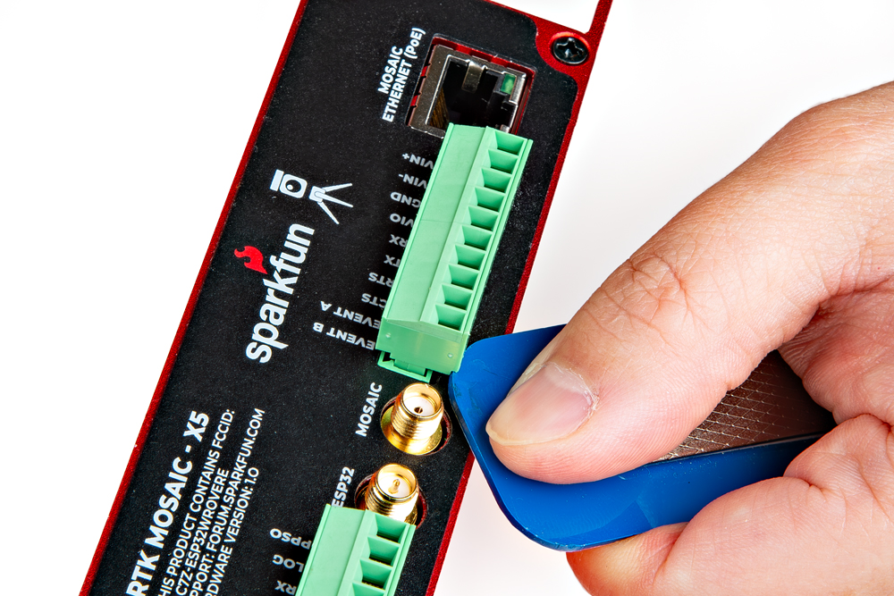

!!! warning "Need Help?"
	If you need technical assistance or more information on a product that is not working as you expected, we recommend heading over to the [SparkFun Technical Assistance](https://www.sparkfun.com/technical_assistance) page for some initial troubleshooting.

	

	[SparkFun Technical Assistance Page](https://www.sparkfun.com/technical_assistance){ .md-button .md-button--primary }
	

	If you can't find what you need there, the [SparkFun GNSS Forum](https://community.sparkfun.com/c/global-positioning-system-gps/96) is a great place to ask questions.

	!!! info "Account Registration Required"
		If this is your first visit to our forum, you'll need to create a [Forum Account](https://forum.sparkfun.com/ucp.php?mode=register) to post questions.

## What is in the Box?

<figure markdown>
[{ width="300" }](https://cdn.sparkfun.com/assets/parts/2/7/2/0/7/26289-GNSS-Disciplined-Oscillator-Kit-Feature.jpg "Click to enlarge")
<figcaption markdown>
Everything that is included in the GNSSDO kit.
</figcaption>
</figure>

The GNSSDO comes packaged as a complete kit, with all the accessories you'd need to set it up. Inside the box, users will find the [GNSS antenna](https://www.sparkfun.com/gnss-multi-band-l1-l2-l5-surveying-antenna-tnc-spk6618h.html), GNSSDO in its aluminum enclosure, [CAT-6 Ethernet cable](https://www.sparkfun.com/cat-6-cable-3ft.html), [USB-C cable](https://www.sparkfun.com/usb-c-to-usb-c-silicone-power-charging-cable-3m.html), and another box containing additional accessories. Inside the accessory box, users will find the [SMA to TNC cable](https://www.sparkfun.com/reinforced-interface-cable-sma-male-to-tnc-male-10m.html), [SMA to BNC cable](https://www.sparkfun.com/sma-to-bnc-male-cable-rg316-1m.html), [USB PD wall adapter](https://www.sparkfun.com/usb-a-and-c-power-delivery-pd-wall-adapter-65w.html), [WiFi antenna](https://www.sparkfun.com/products/145), [silicone bumpers](https://www.sparkfun.com/silicone-bumpers-5x11mm-4-pack.html), and [32GB SD card](https://www.sparkfun.com/microsd-card-32gb-class-10.html).

If you are missing any of these items, please reach out to us in our forum.

[:sfe: SparkFun Forum - GNSS Topic](https://community.sparkfun.com/c/global-positioning-system-gps/96){ .md-button .md-button--primary }

## OLED Dead Pixels
Got a few dead pixels on your OLED display? Please reach out to us in our forum.

[:sfe: SparkFun Forum - GNSS Topic](https://community.sparkfun.com/c/global-positioning-system-gps/96){ .md-button .md-button--primary }

## Data Logging
For data logging issues, here are some simple troubleshooting tips:

- Make sure that your SD card is formatted to a `FAT32` file system.
	- The `FAT32` file system also limits the maximum capacity of the card to less than **32GB** *(i.e. a 256GB SD card will not work)*.
- Make sure that the mosaic-T module has a configured data stream output.
- Use the mosaic-T web page to verify that the SD card is mounted as a storage drive.

## L5 Band
By default, the L5 band is disabled on the mosaic-T. To enable reception of the L5 band on the mosaic-T, we have provided instructions on the [Enable the L5 Band](../L5) page.

## Reprogramming the ESP32
In case users accidentally reprogram or corrupt the flash memory on the ESP32, the **[/Firmware/Binaries](https://github.com/sparkfun/SparkFun_GNSSDO/tree/main/Firmware/Binaries)** folder contains the firmware binaries.

You can update or reload the firmware using the [SparkFun RTK Firmware Uploader](https://github.com/sparkfun/SparkFun_RTK_Firmware_Uploader).

The full firmware source code is available in our [GitHub repository](https://github.com/sparkfun/SparkFun_GNSSDO/tree/main/Firmware/GNSSDO_Firmware)

## Enclosure Disassembly
Due to the ESD sensitivity of the mosaic-T module, we don't recommend disassembling the GNSSDO. However, if users must access the PCB to troubleshoot an issue, make a modification, or repair a component, we highly recommend that they take the necessary ESD precautions to avoid damaging the mosaic-T module.

!!! warning "Read Before Disassembly!"
	!!! danger "ESD Sensitivity"
		The mosaic-T module is sensitive to [ESD](https://en.wikipedia.org/wiki/Electrostatic_discharge "Electrostatic Discharge"). Use a proper grounding system to make sure that the working surface and the components are at the same electric potential.

	??? info "ESD Precaution"
		As recommended by the manufacturer, we highly encourage users to take the necessary precautions to avoid damaging their module.

		- The GNSSDO features ESD protection on the USB-C connectors, ethernet jack, I/O terminals and SMA antenna connections.

		

		

		

		<article class="video-500px">
		<iframe src="https://www.youtube.com/embed/hrL5J6Q5gX8?si=jOPBat8rzMnL7Uz4&amp;start=26;&amp;end=35;" title="Septentrio: Getting Started Video (playback starts at ESD warning)" frameborder="0" allow="accelerometer; autoplay; clipboard-write; encrypted-media; gyroscope; picture-in-picture" allowfullscreen></iframe>
		</article>
		

		

		-   <a href="https://www.sparkfun.com/products/25572">
			<figure markdown>
			
			</figure>		

			---

			**iFixit Anti-Static Wrist Strap** 
			TOL-25572</a>

		

Before disassembling the enclosure, users should disconnect the power and all cables from the GNSSDO. This will prevent users from creating any shorts and will facilitate the teardown process further on.

The GNSSDO PCB is held in place by the front and rear panels of the enclosure. While users can remove the panels first, we recommend that users disconnect the screw terminal blocks first. Users may find it more difficult to separate the terminal block from the connector later in the disassembly process.

???+ tip "Remove the Screw Terminal Block First"
	Users may find it easiest to remove the screw terminal blocks first; as opposed to later in the teardown process.

	<figure markdown>
	[{ width="400" }](./assets/img/hookup_guide/disassembly-terminal_block.jpg "Click to enlarge")
	<figcaption markdown>Using a soft/rigid object to carefully pry the terminal block off.</figcaption>
	</figure>

	Users can wiggle or use a soft/rigid object to carefully pry the terminal block off. In the picture above, a plastic name tag (~1.5mm thick) is used to carefully pry the terminal block up. We have also found the edge of a [PCB ruler](https://www.sparkfun.com/products/15295) works great too.

Once the terminal blocks have been removed, users can remove the front and rear panels of the enclosure. They are held in place with four, M3, Phillips head screws on the corners of each panel.

!!!  "Remove Front Panel First"
	We recommend removing the front panel first to prevent the Qwiic cable from being yanked off the OLED display or main PCB. Once the front panel is free, carefully lift the panel and disconnect the Qwiic cable from the top connector on the OLED display.

At this point, if users have previously disconnected all the cables and the terminal blocks from the back, the GNSSDO PCB should slide out of the enclosure. Users can then, remove the rear panel from the enclosure to complete the teardown process.

<!-- QR Code for Hookup Guide (Displayed when printed) -->

{ .qr }

